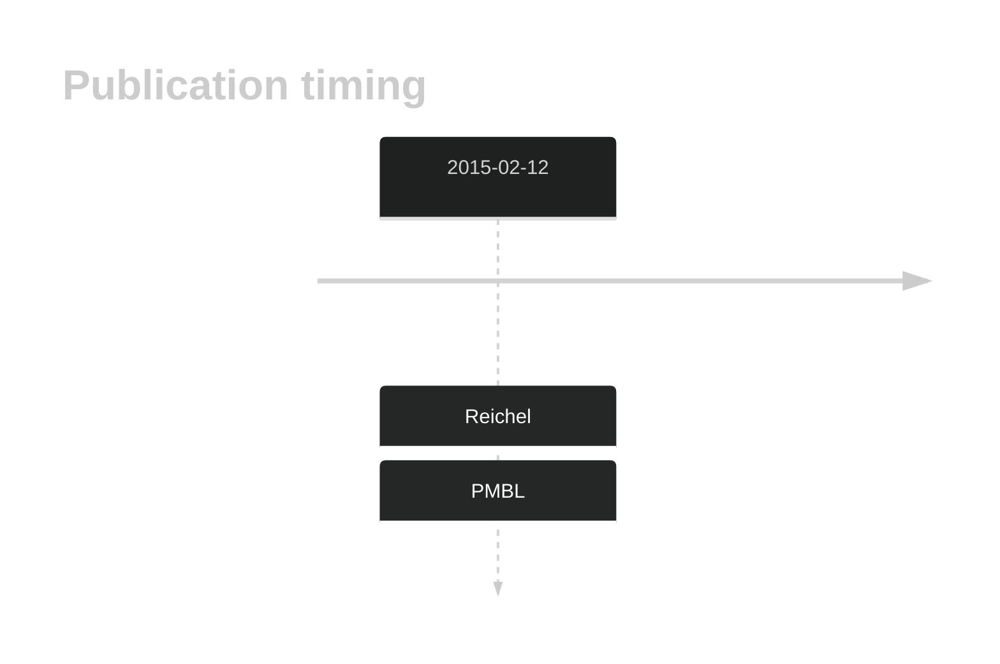

# RANBP2

## History

## Relevance tier by entity

|Entity|Tier|Description|
|:------:|:----:|--------------------------------------|
||2|relevance in PMBL/cHL/GZL not firmly established[@reichelFlowSortingExome2015]|

## Mutation incidence in large patient cohorts (GAMBL reanalysis)

|Entity|source |frequency (%)|
|:------:|:----:|:----:|
|BL|GAMBL Exome |4.598 |
|BL|GAMBL Genome |1.931 |
|DLBCL|GAMBL Exome |2.264 |
|DLBCL|GAMBL Genome |2.444 |
|FL|GAMBL Exome |0.287 |
|MCL|GAMBL Genome |1.17 |

## References

