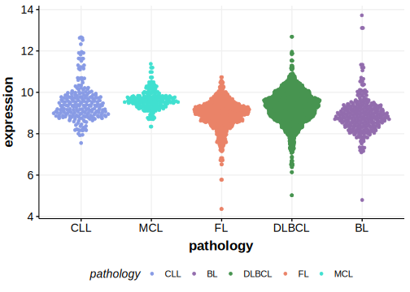

[[_TOC_]]

## Relevance tier by entity

[[include:table1_RARA.md]]

## Warnings

<<Warn("The variants reported in this gene in DLBCL failed QC")>>

## Mutation incidence in large patient cohorts (GAMBL reanalysis)

|Entity|source        |frequency (%)|
|:------:|:--------------:|:-------------:|
|DLBCL |GAMBL genomes |1.34         |
|DLBCL |Schmitz cohort|4.04         |
|DLBCL |Reddy cohort  |0.70         |
|DLBCL |Chapuy cohort |0.43         |

## Mutation pattern and selective pressure estimates

[[include:tables/dnds_RARA.md]]

[[include:browser_RARA.md]]

## Expression

<!-- ORIGIN: reddyGeneticFunctionalDrivers2017 -->
<!-- DLBCL: reddyGeneticFunctionalDrivers2017 -->

[[include:tables/mermaid_RARA.md]]

## References

