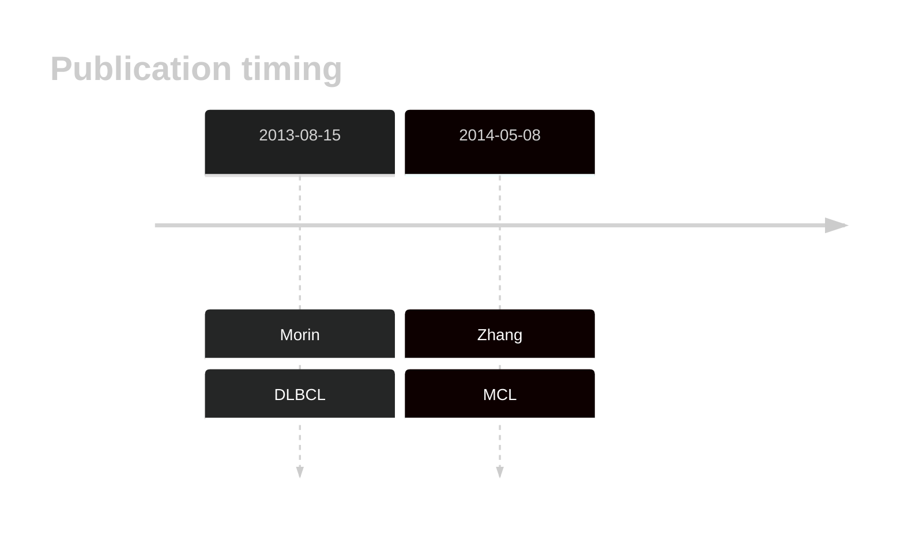
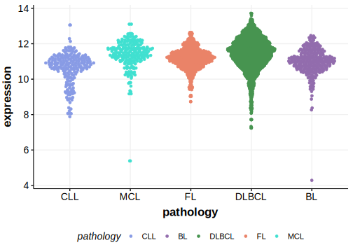

# RB1
## History

## Relevance tier by entity

|Entity|Tier|Description               |
|:------:|:----:|--------------------------|
| |1   |high-confidence DLBCL gene|
|   |1   |high-confidence MCL gene  |

## Mutation incidence in large patient cohorts (GAMBL reanalysis)

|Entity|source        |frequency (%)|
|:------:|:--------------:|:-------------:|
|DLBCL |GAMBL genomes |4.78         |
|DLBCL |Schmitz cohort|3.19         |
|DLBCL |Reddy cohort  |1.60         |
|DLBCL |Chapuy cohort |3.85         |
|MCL   |GAMBL genomes |0.47         |

## Mutation pattern and selective pressure estimates

|Entity|aSHM|Significant selection|dN/dS (missense)|dN/dS (nonsense)|
|:------:|:----:|:---------------------:|:----------------:|:----------------:|
|BL    |No  |No                   |1.029           | 6.855          |
|DLBCL |No  |Yes                  |0.933           |17.514          |
|FL    |No  |No                   |1.890           | 0.000          |

> [!NOTE]
> First described in DLBCL in 2013 by [Morin RD](https://pubmed.ncbi.nlm.nih.gov/23699601). First described in MCL in 2014 by [Zhang J](https://pubmed.ncbi.nlm.nih.gov/24682267)

View coding variants in ProteinPaint [hg19](https://morinlab.github.io/LLMPP/GAMBL/RB1_protein.html)  or [hg38](https://morinlab.github.io/LLMPP/GAMBL/RB1_protein_hg38.html)

View all variants in GenomePaint [hg19](https://morinlab.github.io/LLMPP/GAMBL/RB1.html)  or [hg38](https://morinlab.github.io/LLMPP/GAMBL/RB1_hg38.html)

## RB1 Expression

<!-- ORIGIN: morinMutationalStructuralAnalysis2013 -->
<!-- DLBCL: morinMutationalStructuralAnalysis2013 -->
<!-- MCL: zhangGenomicLandscapeMantle2014 -->
## References
1.  Morin RD, Mungall K, Pleasance E, Mungall AJ, Goya R, Huff RD, Scott DW, Ding J, Roth A, Chiu R, Corbett RD, Chan FC, Mendez-Lago M, Trinh DL, Bolger-Munro M, Taylor G, Hadj Khodabakhshi A, Ben-Neriah S, Pon J, Meissner B, Woolcock B, Farnoud N, Rogic S, Lim EL, Johnson NA, Shah S, Jones S, Steidl C, Holt R, Birol I, Moore R, Connors JM, Gascoyne RD, Marra MA. Mutational and structural analysis of diffuse large B-cell lymphoma using whole-genome sequencing. Blood. 2013 Aug 15;122(7):1256–1265. PMCID: PMC3744992
2.  Zhang J, Jima D, Moffitt AB, Liu Q, Czader M, Hsi ED, Fedoriw Y, Dunphy CH, Richards KL, Gill JI, Sun Z, Love C, Scotland P, Lock E, Levy S, Hsu DS, Dunson D, Dave SS. The genomic landscape of mantle cell lymphoma is related to the epigenetically determined chromatin state of normal B cells. Blood. 2014 May 8;123(19):2988–2996. 
