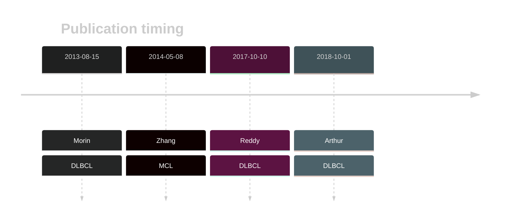

# RB1

## History

## Relevance tier by entity

|Entity|Tier|Description               |
|:------:|:----:|--------------------------|
| |1   |high-confidence DLBCL gene[@morinMutationalStructuralAnalysis2013; @reddyGeneticFunctionalDrivers2017; @arthurGenomewideDiscoverySomatic2018]|
|   |1   |high-confidence MCL gene  [@zhangGenomicLandscapeMantle2014]|

## Mutation incidence in large patient cohorts (GAMBL reanalysis)

[[include:DLBCL_RB1.md]]

## Mutation pattern and selective pressure estimates

[[include:dnds_RB1.md]]

View coding variants in ProteinPaint [hg19](https://morinlab.github.io/LLMPP/GAMBL/RB1_protein.html)  or [hg38](https://morinlab.github.io/LLMPP/GAMBL/RB1_protein_hg38.html)

View all variants in GenomePaint [hg19](https://morinlab.github.io/LLMPP/GAMBL/RB1.html)  or [hg38](https://morinlab.github.io/LLMPP/GAMBL/RB1_hg38.html)

## RB1 Expression

<!-- ORIGIN: morinMutationalStructuralAnalysis2013 -->
<!-- DLBCL: morinMutationalStructuralAnalysis2013 -->
<!-- MCL: zhangGenomicLandscapeMantle2014 -->

## References

