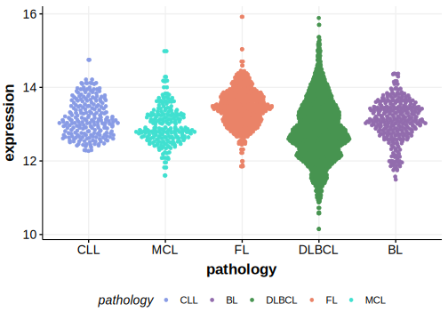

[[_TOC_]]

## Overview

Mutations in this gene were first described in DLBCL and FL in 2021 by Hübschmann et al.[@hubschmannMutationalMechanismsShaping2021]

## Relevance tier by entity

[[include:tables/table1_RBM6.md]]

## Mutation incidence in large patient cohorts (GAMBL reanalysis)

|Entity|source       |frequency (%)|
|:------:|:-------------:|:-------------:|
|FL    |GAMBL genomes|0.46         |

## Mutation pattern and selective pressure estimates

[[include:tables/dnds_RBM6.md]]

[[include:browser_RBM6.md]]

## Expression

## All Mutations

[SP193025](https://www.bcgsc.ca/downloads/morinlab/GAMBL/MALY/SP193025.html)
[SP59320](https://www.bcgsc.ca/downloads/morinlab/GAMBL/MALY/SP59320.html)

[[include:tables/mermaid_RBM6.md]]

## References

<!-- ORIGIN: hubschmannMutationalMechanismsShaping2021b -->
<!-- FL: hubschmannMutationalMechanismsShaping2021b -->
