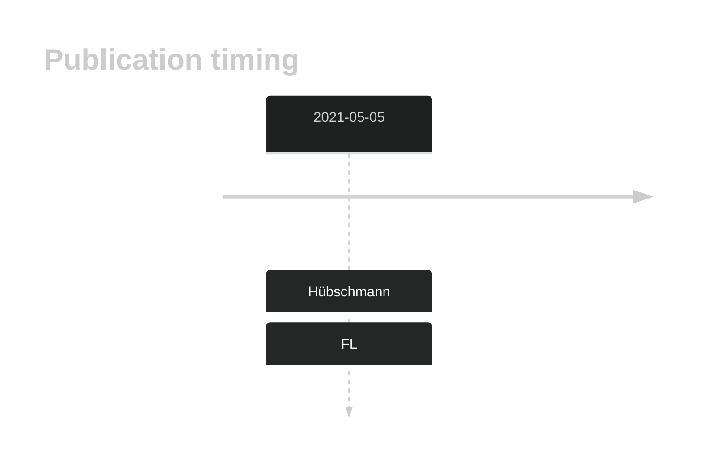
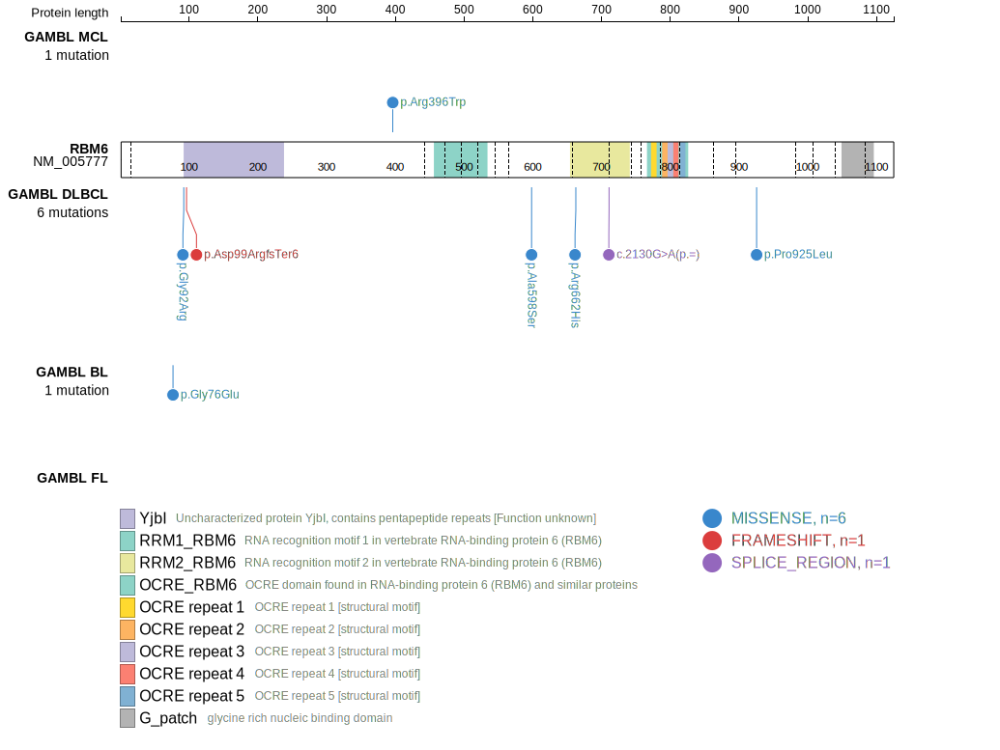
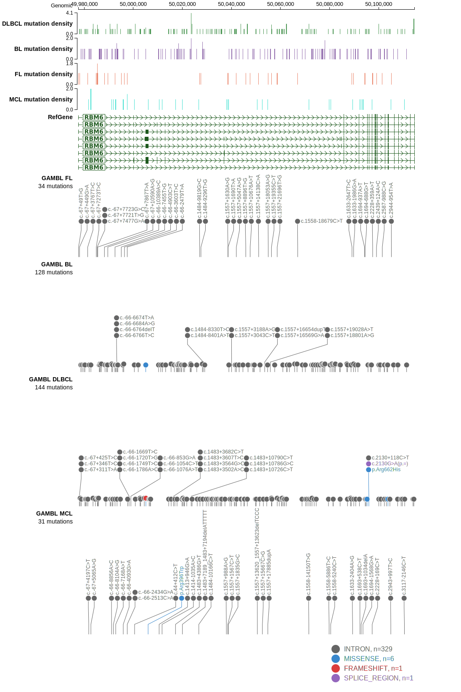

# RBM6

## History
Mutations in this gene were first described in DLBCL and FL in 2021 by Hübschmann et al.1

## Relevance tier by entity

|Entity|Tier|Description                           |
|:------:|:----:|--------------------------------------|
|    |2   |relevance in FL not firmly established[@hubschmannMutationalMechanismsShaping2021]|

## Mutation incidence in large patient cohorts (GAMBL reanalysis)

|Entity|source       |frequency (%)|
|:------:|:-------------:|:-------------:|
|FL    |GAMBL genomes|0.46         |

## Mutation pattern and selective pressure estimates

|Entity|aSHM|Significant selection|dN/dS (missense)|dN/dS (nonsense)|
|:------:|:----:|:---------------------:|:----------------:|:----------------:|
|BL    |No  |No                   |0.85            |0               |
|DLBCL |No  |No                   |0.00            |0               |
|FL    |No  |No                   |0.00            |0               |

View coding variants in ProteinPaint [hg19](https://morinlab.github.io/LLMPP/GAMBL/RBM6_protein.html)  or [hg38](https://morinlab.github.io/LLMPP/GAMBL/RBM6_protein_hg38.html)

View all variants in GenomePaint [hg19](https://morinlab.github.io/LLMPP/GAMBL/RBM6.html)  or [hg38](https://morinlab.github.io/LLMPP/GAMBL/RBM6_hg38.html)

## RBM6 Expression

## All Mutations

[SP193025](https://www.bcgsc.ca/downloads/morinlab/GAMBL/MALY/SP193025.html)
[SP59320](https://www.bcgsc.ca/downloads/morinlab/GAMBL/MALY/SP59320.html)

## References

<!-- ORIGIN: hubschmannMutationalMechanismsShaping2021b -->
<!-- FL: hubschmannMutationalMechanismsShaping2021b -->
