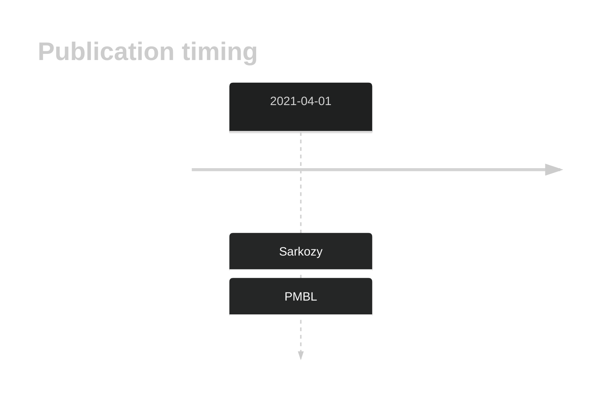

# RELN

## History

## Relevance tier by entity

|Entity|Tier|Description|
|:------:|:----:|--------------------------------------|
||2|relevance in PMBL/cHL/GZL not firmly established[@sarkozyMutationalLandscapeGray2021]|

## Mutation incidence in large patient cohorts (GAMBL reanalysis)

|Entity|source |frequency (%)|
|:------:|:----:|:----:|
|BL|GAMBL Exome |10.345 |
|BL|GAMBL Genome |3.475 |
|DLBCL|GAMBL Exome |5.876 |
|DLBCL|GAMBL Genome |4.699 |
|FL|GAMBL Exome |0.86 |
|MCL|GAMBL Genome |2.339 |

## References

