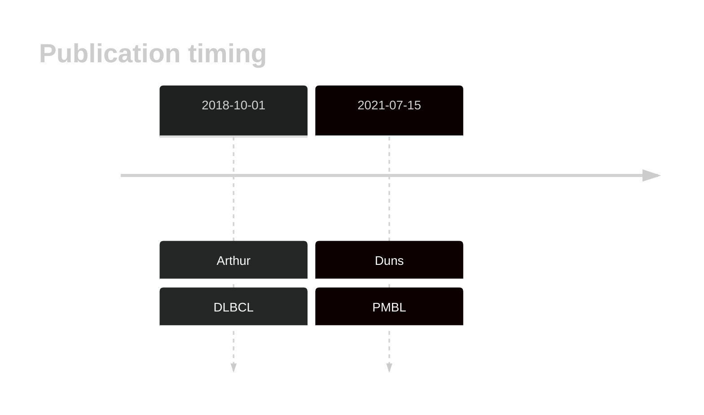

# RFTN1
## History

## Relevance tier by entity

|Entity|Tier|Description                              |
|:------:|:----:|-----------------------------------------|
||2|relevance in PMBL/cHL/GZL not firmly established|
||2|relevance in MZL not firmly established|
| |2-a | aSHM target; Although recurrent, the relevance of mutations in DLBCL is tenuous |

## Mutation incidence in large patient cohorts (GAMBL reanalysis)

|Entity|source        |frequency (%)|
|:------:|:--------------:|:-------------:|
|DLBCL |GAMBL genomes |4.59         |
|DLBCL |Schmitz cohort|5.96         |
|DLBCL |Reddy cohort  |4.40         |
|DLBCL |Chapuy cohort |4.70         |

## Mutation pattern and selective pressure estimates

|Entity|aSHM|Significant selection|dN/dS (missense)|dN/dS (nonsense)|
|:------:|:----:|:---------------------:|:----------------:|:----------------:|
|BL    |Yes |No                   |1.080           |0.000           |
|DLBCL |Yes |No                   |3.636           |3.809           |
|FL    |Yes |No                   |2.622           |0.000           |

## aSHM regions

|chr_name|hg19_start|hg19_end|region                                                                                   |regulatory_comment             |
|:--------:|:----------:|:--------:|:-----------------------------------------------------------------------------------------:|:-------------------------------:|
|chr3    |16546433  |16556786|[TSS](https://genome.ucsc.edu/s/rdmorin/GAMBL%20hg19?position=chr3%3A16546433%2D16556786)|active_promoter-strong_enhancer|

> [!NOTE]
> First described in DLBCL in 2018 by [Arthur SE](https://pubmed.ncbi.nlm.nih.gov/30275490)

View coding variants in ProteinPaint [hg19](https://morinlab.github.io/LLMPP/GAMBL/RFTN1_protein.html)  or [hg38](https://morinlab.github.io/LLMPP/GAMBL/RFTN1_protein_hg38.html)

View all variants in GenomePaint [hg19](https://morinlab.github.io/LLMPP/GAMBL/RFTN1.html)  or [hg38](https://morinlab.github.io/LLMPP/GAMBL/RFTN1_hg38.html)

## RFTN1 Expression

<!-- ORIGIN: arthurGenomewideDiscoverySomatic2018 -->
<!-- PMBL: dunsCharacterizationDLBCLPMBL2021b -->
<!-- DLBCL: arthurGenomewideDiscoverySomatic2018 -->
## References
1.  Arthur SE, Jiang A, Grande BM, Alcaide M, Cojocaru R, Rushton CK, Mottok A, Hilton LK, Lat PK, Zhao EY, Culibrk L, Ennishi D, Jessa S, Chong L, Thomas N, Pararajalingam P, Meissner B, Boyle M, Davidson J, Bushell KR, Lai D, Farinha P, Slack GW, Morin GB, Shah S, Sen D, Jones SJM, Mungall AJ, Gascoyne RD, Audas TE, Unrau P, Marra MA, Connors JM, Steidl C, Scott DW, Morin RD. Genome-wide discovery of somatic regulatory variants in diffuse large B-cell lymphoma. Nat Commun. 2018 Oct 1;9(1):4001. PMCID: PMC6167379
2.  Duns G, Viganò E, Ennishi D, Sarkozy C, Hung SS, Chavez E, Takata K, Rushton C, Jiang A, Ben-Neriah S, Woolcock BW, Slack GW, Hsi ED, Craig JW, Hilton LK, Shah SP, Farinha P, Mottok A, Gascoyne RD, Morin RD, Savage KJ, Scott DW, Steidl C. Characterization of DLBCL with a PMBL gene expression signature. Blood. 2021 Jul 15;138(2):136–148. PMID: 33684939
