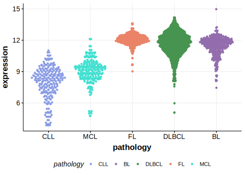

[[_TOC_]]

## Relevance tier by entity

[[include:tables/table1_RFTN1.md]]

## Mutation incidence in large patient cohorts (GAMBL reanalysis)

|Entity|source        |frequency (%)|
|:------:|:--------------:|:-------------:|
|DLBCL |GAMBL genomes |4.59         |
|DLBCL |Schmitz cohort|5.96         |
|DLBCL |Reddy cohort  |4.40         |
|DLBCL |Chapuy cohort |4.70         |

## Mutation pattern and selective pressure estimates

[[include:tables/dnds_RFTN1.md]]

## aSHM regions

|chr_name|hg19_start|hg19_end|region                                                                                   |regulatory_comment             |
|:--------:|:----------:|:--------:|:-----------------------------------------------------------------------------------------:|:-------------------------------:|
|chr3    |16546433  |16556786|[TSS](https://genome.ucsc.edu/s/rdmorin/GAMBL%20hg19?position=chr3%3A16546433%2D16556786)|active_promoter-strong_enhancer|

[[include:tables/browser_RFTN1.md]]

## Expression

<!-- ORIGIN: arthurGenomewideDiscoverySomatic2018 -->
<!-- PMBL: dunsCharacterizationDLBCLPMBL2021b -->
<!-- DLBCL: arthurGenomewideDiscoverySomatic2018 -->

[[include:tables/mermaid_RFTN1.md]]

## References

