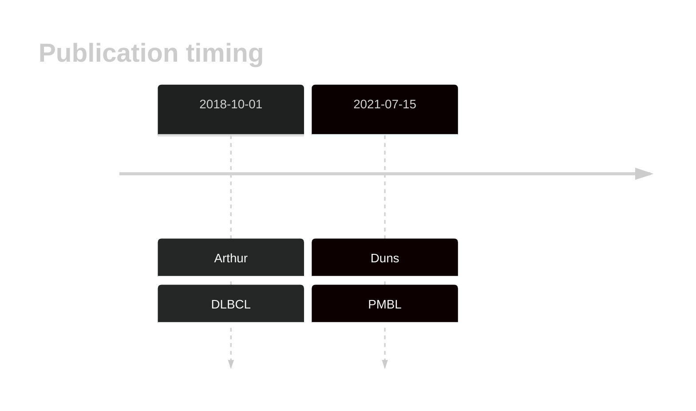

# RFTN1

## History

## Relevance tier by entity

|Entity|Tier|Description                              |
|:------:|:----:|-----------------------------------------|
||2|relevance in PMBL/cHL/GZL not firmly established[@dunsCharacterizationDLBCLPMBL2021]|
||2|relevance in MZL not firmly established|
| |2-a | aSHM target; Although recurrent, the relevance of mutations in DLBCL is tenuous [@arthurGenomewideDiscoverySomatic2018]|

## Mutation incidence in large patient cohorts (GAMBL reanalysis)

|Entity|source        |frequency (%)|
|:------:|:--------------:|:-------------:|
|DLBCL |GAMBL genomes |4.59         |
|DLBCL |Schmitz cohort|5.96         |
|DLBCL |Reddy cohort  |4.40         |
|DLBCL |Chapuy cohort |4.70         |

## Mutation pattern and selective pressure estimates

|Entity|aSHM|Significant selection|dN/dS (missense)|dN/dS (nonsense)|
|:------:|:----:|:---------------------:|:----------------:|:----------------:|
|BL    |Yes |No                   |1.080           |0.000           |
|DLBCL |Yes |No                   |3.636           |3.809           |
|FL    |Yes |No                   |2.622           |0.000           |

## aSHM regions

|chr_name|hg19_start|hg19_end|region                                                                                   |regulatory_comment             |
|:--------:|:----------:|:--------:|:-----------------------------------------------------------------------------------------:|:-------------------------------:|
|chr3    |16546433  |16556786|[TSS](https://genome.ucsc.edu/s/rdmorin/GAMBL%20hg19?position=chr3%3A16546433%2D16556786)|active_promoter-strong_enhancer|

View coding variants in ProteinPaint [hg19](https://morinlab.github.io/LLMPP/GAMBL/RFTN1_protein.html)  or [hg38](https://morinlab.github.io/LLMPP/GAMBL/RFTN1_protein_hg38.html)

View all variants in GenomePaint [hg19](https://morinlab.github.io/LLMPP/GAMBL/RFTN1.html)  or [hg38](https://morinlab.github.io/LLMPP/GAMBL/RFTN1_hg38.html)

## RFTN1 Expression

<!-- ORIGIN: arthurGenomewideDiscoverySomatic2018 -->
<!-- PMBL: dunsCharacterizationDLBCLPMBL2021b -->
<!-- DLBCL: arthurGenomewideDiscoverySomatic2018 -->

## References

