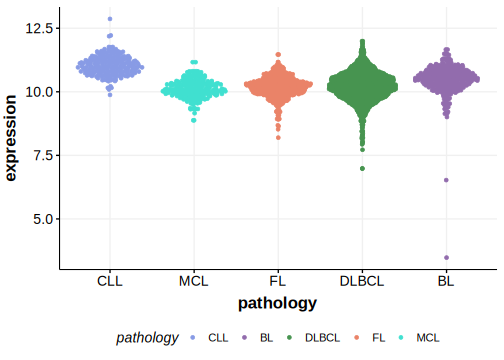

[[_TOC_]]

## Overview

First described as mutated in BL in 2009 by Grande et al.[@grandeGenomewideDiscoverySomatic2019]

## Relevance tier by entity

|Entity|Tier|Description               |
|:------:|:----:|--------------------------|
|    |1   |high-confidence BL gene   [@grandeGenomewideDiscoverySomatic2019]|
| |1   |high-confidence DLBCL gene[@arthurGenomewideDiscoverySomatic2018]|

## Mutation incidence in large patient cohorts (GAMBL reanalysis)

[[include:DLBCL_RFX7.md]]
[[include:BL_RFX7.md]]

## Mutation pattern and selective pressure estimates

[[include:dnds_RFX7.md]]

[[include:browser_RFX7.md]]

## Expression

[[include:mermaid_RFX7.md]]

## References

<!-- ORIGIN: grandeGenomewideDiscoverySomatic2019 -->
<!-- BL: grandeGenomewideDiscoverySomatic2019 -->
