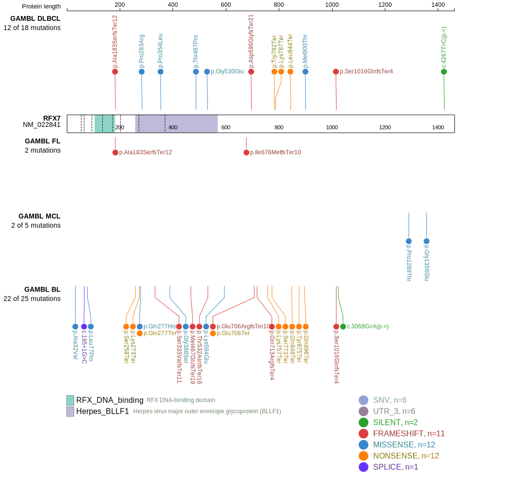
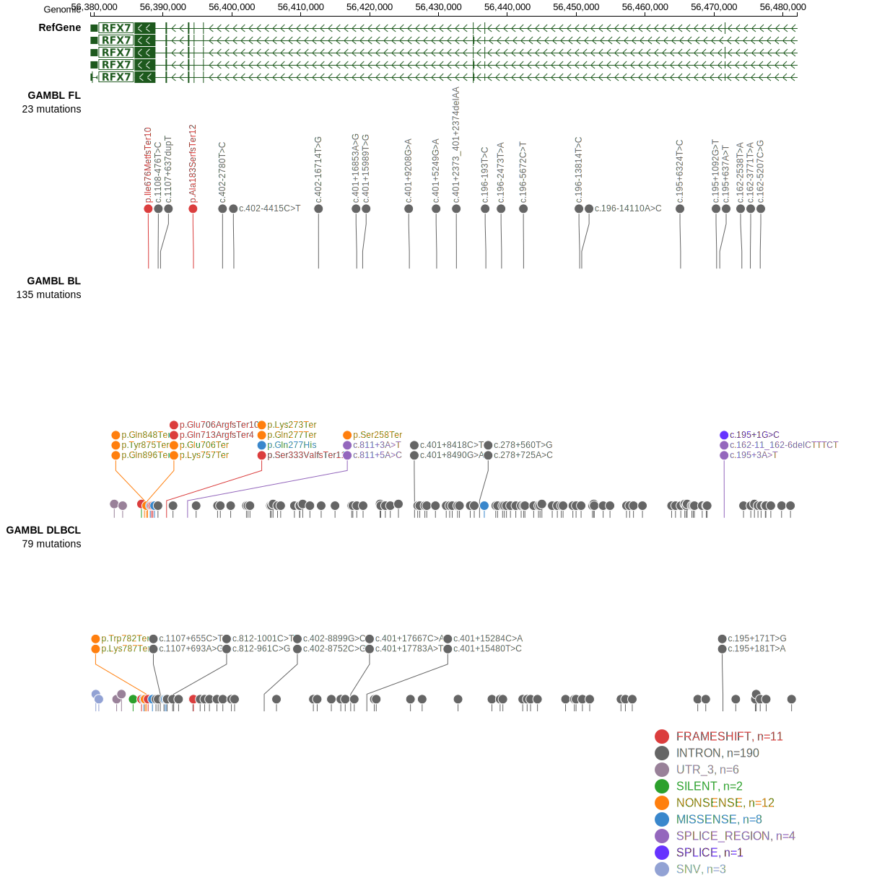

# [RFX7]

## Mutation tier

|Entity|Tier|Description               |
|:------:|:----:|--------------------------|
|BL    |1   |high-confidence BL gene   |
|DLBCL |1   |high-confidence DLBCL gene|
## Mutation incidence

|Entity|source               |frequency (%)|
|:------:|:---------------------:|:-------------:|
|BL    |GAMBL genomes+capture|9.47         |
|BL    |Thomas cohort        |9.30         |
|BL    |Panea cohort         |4.00         |
|DLBCL |GAMBL genomes        |4.02         |
|DLBCL |Schmitz cohort       |1.90         |
|DLBCL |Reddy cohort         |3.40         |
|DLBCL |Chapuy cohort        |4.70         |

## Mutation pattern

|Entity|aSHM|Significant selection|dN/dS (missense)|dN/dS (nonsense)|
|:------:|:----:|:---------------------:|:----------------:|:----------------:|
|BL    |No  |Yes                  |2.347           |98.419          |
|DLBCL |No  |No                   |1.219           |17.441          |
|FL    |No  |No                   |0.000           | 0.000          |

View coding variants in ProteinPaint [hg19](https://www.bcgsc.ca/downloads/morinlab/GAMBL/test/genes/RFX7_protein.html)  or [hg38](https://www.bcgsc.ca/downloads/morinlab/GAMBL/test/genes/RFX7_protein_hg38.html)

View all variants in GenomePaint [hg19](https://www.bcgsc.ca/downloads/morinlab/GAMBL/test/genes/RFX7.html)

