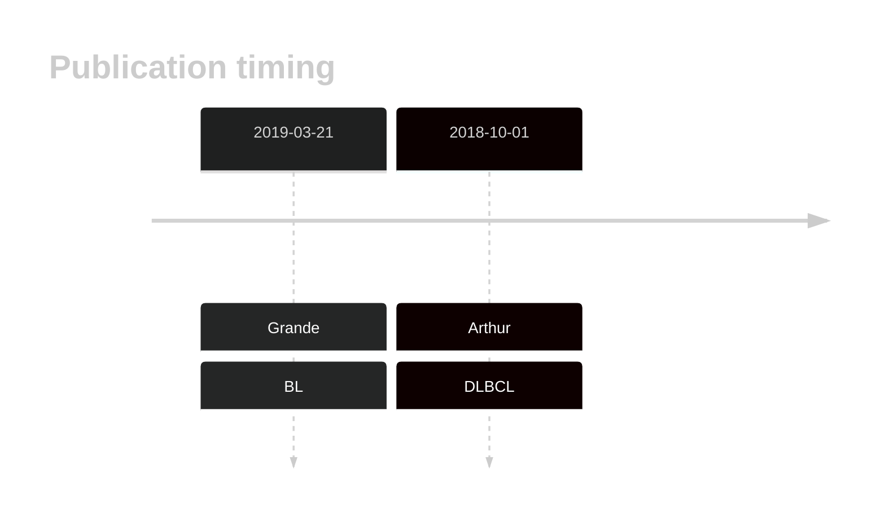

# RFX7

## History
First described as mutated in BL in 2009 by Grande et al.1

## Relevance tier by entity

|Entity|Tier|Description               |
|:------:|:----:|--------------------------|
|    |1   |high-confidence BL gene   [@grandeGenomewideDiscoverySomatic2019]|
| |1   |high-confidence DLBCL gene[@arthurGenomewideDiscoverySomatic2018]|

## Mutation incidence in large patient cohorts (GAMBL reanalysis)

[[include:DLBCL_RFX7.md]]
[[include:BL_RFX7.md]]

## Mutation pattern and selective pressure estimates

[[include:dnds_RFX7.md]]

View coding variants in ProteinPaint [hg19](https://morinlab.github.io/LLMPP/GAMBL/RFX7_protein.html)  or [hg38](https://morinlab.github.io/LLMPP/GAMBL/RFX7_protein_hg38.html)

View all variants in GenomePaint [hg19](https://morinlab.github.io/LLMPP/GAMBL/RFX7.html)  or [hg38](https://morinlab.github.io/LLMPP/GAMBL/RFX7_hg38.html)

## RFX7 Expression

## References

<!-- ORIGIN: grandeGenomewideDiscoverySomatic2019 -->
<!-- BL: grandeGenomewideDiscoverySomatic2019 -->
