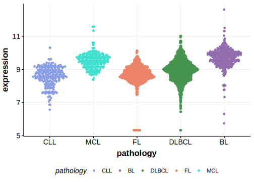

# RFXAP

## Relevance tier by entity

|Entity|Tier|Description               |
|:------:|:----:|--------------------------|
| |2   |low-confidence DLBCL gene|

## Mutation incidence in large patient cohorts (GAMBL reanalysis)

|Entity|source        |frequency (%)|
|:------:|:--------------:|:-------------:|
|DLBCL |GAMBL genomes |1.34         |
|DLBCL |Schmitz cohort|1.28         |
|DLBCL |Reddy cohort  |0.60         |
|DLBCL |Chapuy cohort |  NA         |

## Mutation pattern and selective pressure estimates

|Entity|aSHM|Significant selection|dN/dS (missense)|dN/dS (nonsense)|
|:------:|:----:|:---------------------:|:----------------:|:----------------:|
|BL    |No  |No                   |2.222           |91.553          |
|DLBCL |No  |No                   |3.462           |29.787          |
|FL    |No  |No                   |4.119           | 0.000          |

[[include:tables/browser_RFXAP.md]]

## Expression

<!-- ORIGIN: Unknown -->

## References
