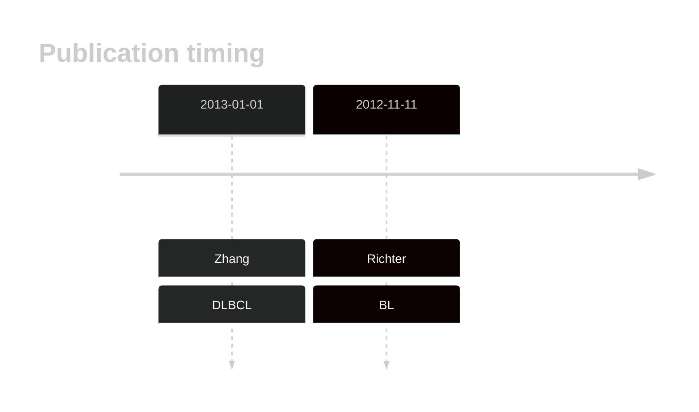
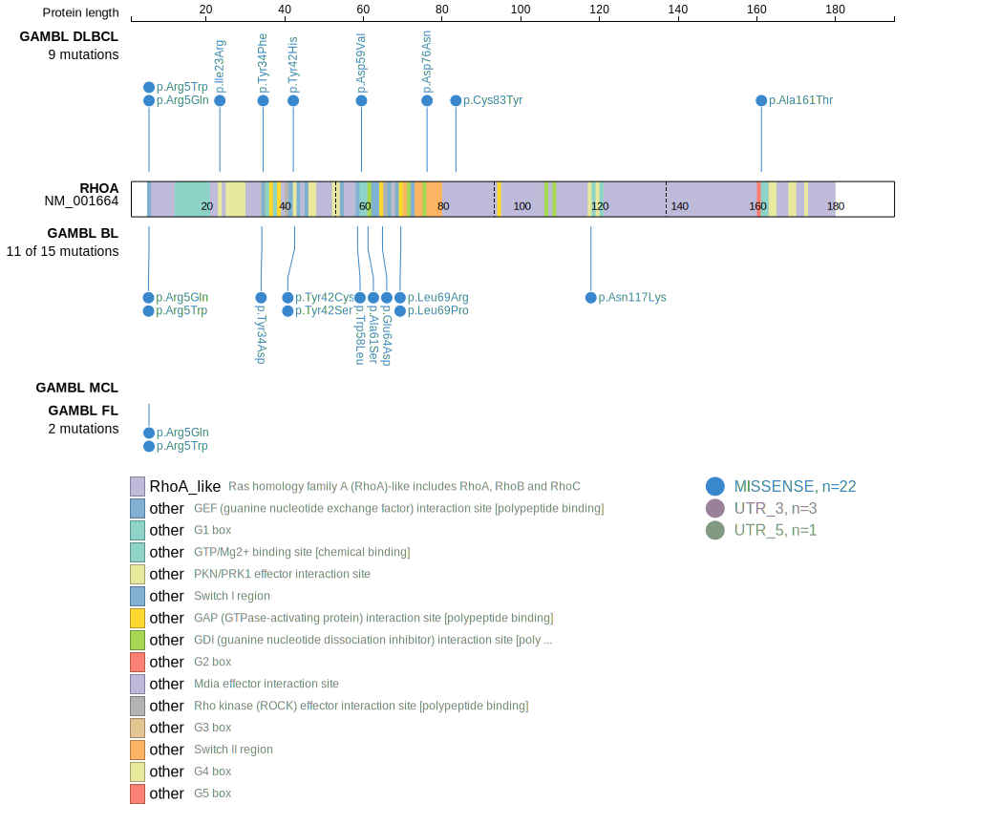
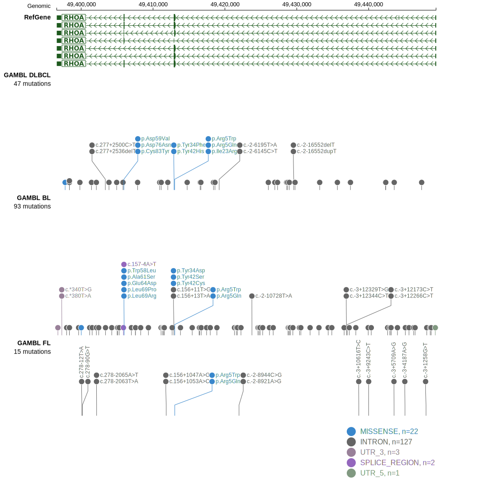
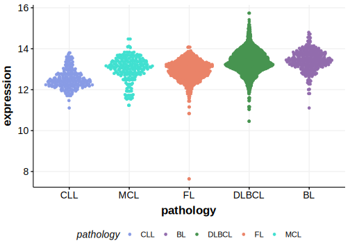

# RHOA

## History

## Relevance tier by entity

|Entity|Tier|Description               |
|:------:|:----:|--------------------------|
||1|high-confidence PMBL/cHL/GZL gene|
|    |1   |high-confidence BL gene   [@richterRecurrentMutationID32012a]|
| |1   |high-confidence DLBCL gene[@zhangGeneticHeterogeneityDiffuse2013]|

## Mutation incidence in large patient cohorts (GAMBL reanalysis)

|Entity|source               |frequency (%)|
|:------:|:---------------------:|:-------------:|
|BL    |GAMBL genomes+capture| 9.47        |
|BL    |Thomas cohort        | 8.10        |
|BL    |Panea cohort         |12.90        |
|DLBCL |GAMBL genomes        | 3.06        |
|DLBCL |Schmitz cohort       | 3.62        |
|DLBCL |Reddy cohort         | 3.30        |
|DLBCL |Chapuy cohort        | 5.13        |

## Mutation pattern and selective pressure estimates

|Entity|aSHM|Significant selection|dN/dS (missense)|dN/dS (nonsense)|
|:------:|:----:|:---------------------:|:----------------:|:----------------:|
|BL    |No  |Yes                  |88.993          |0               |
|DLBCL |No  |Yes                  |52.294          |0               |
|FL    |No  |No                   |31.528          |0               |

## RHOA Hotspots

| Chromosome |Coordinate (hg19) | ref>alt | HGVSp | 
 | :---:| :---: | :--: | :---: |
| chr3 | 49413010 | G>A | R5W |
| chr3 | 49413009 | C>T | R5Q |
| chr3 | 49412923 | A>C | Y34D |
| chr3 | 49412922 | T>A | Y34F |
| chr3 | 49412899 | A>G | Y42H |
| chr3 | 49412898 | T>G | Y42S |
| chr3 | 49412898 | T>C | Y42C |

View coding variants in ProteinPaint [hg19](https://morinlab.github.io/LLMPP/GAMBL/RHOA_protein.html)  or [hg38](https://morinlab.github.io/LLMPP/GAMBL/RHOA_protein_hg38.html)

View all variants in GenomePaint [hg19](https://morinlab.github.io/LLMPP/GAMBL/RHOA.html)  or [hg38](https://morinlab.github.io/LLMPP/GAMBL/RHOA_hg38.html)

## RHOA Expression

<!-- ORIGIN: pasqualucciHypermutationMultipleProtooncogenes2001a -->
<!-- DLBCL: pasqualucciHypermutationMultipleProtooncogenes2001a -->
<!-- BL: richterRecurrentMutationID32012a -->

## References

