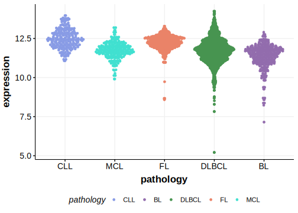

# RHOH

## Relevance tier by entity

|Entity|Tier|Description                              |
|:------:|:----:|-----------------------------------------|
| |2-a | aSHM target; Although recurrent, the relevance of mutations in DLBCL is tenuous [@pasqualucciHypermutationMultipleProtooncogenes2001]|

## Mutation incidence in large patient cohorts (GAMBL reanalysis)

|Entity|source        |frequency (%)|
|:------:|:--------------:|:-------------:|
|DLBCL |GAMBL genomes |1.15         |
|DLBCL |Schmitz cohort|0.43         |
|DLBCL |Reddy cohort  |0.10         |
|DLBCL |Chapuy cohort |  NA         |

## Mutation pattern and selective pressure estimates

[[include:dnds_RHOH.md]]

## aSHM regions

|chr_name|hg19_start|hg19_end|region                                                                                   |regulatory_comment|
|:--------:|:----------:|:--------:|:-----------------------------------------------------------------------------------------:|:------------------:|
|chr4    |40193105  |40204231|[TSS](https://genome.ucsc.edu/s/rdmorin/GAMBL%20hg19?position=chr4%3A40193105%2D40204231)|active_promoter   |

[[include:browser_RHOH.md]]

## Expression

<!-- ORIGIN: pasqualucciHypermutationMultipleProtooncogenes2001a -->
<!-- DLBCL: pasqualucciHypermutationMultipleProtooncogenes2001a -->

## References
