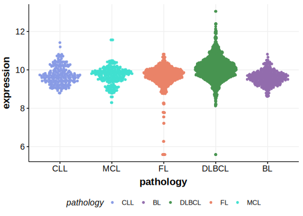

[[_TOC_]]

## Experimental Evidence

Driver mutations affecting this gene in DLBCL/FL have been experimentally demonstrated to cause a gain of function (GOF).[@okosunRecurrentMTORC1activatingRRAGC2016]

## Relevance tier by entity

[[include:tables/table1_RRAGC.md]]

## Mutation incidence in large patient cohorts (GAMBL reanalysis)

### DLBCL
[[include:tables/DLBCL_RRAGC.md]]

### FL
[[include:tables/FL_RRAGC.md]]

## Mutation pattern and selective pressure estimates

[[include:tables/dnds_RRAGC.md]]

[[include:tables/browser_RRAGC.md]]

## Expression

<!-- ORIGIN: okosunRecurrentMTORC1activatingRRAGC2016a -->
<!-- DLBCL: okosunRecurrentMTORC1activatingRRAGC2016a -->

[[include:tables/mermaid_RRAGC.md]]

## References

