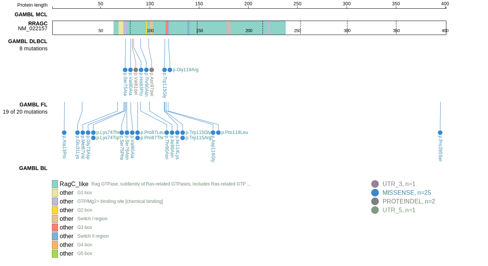
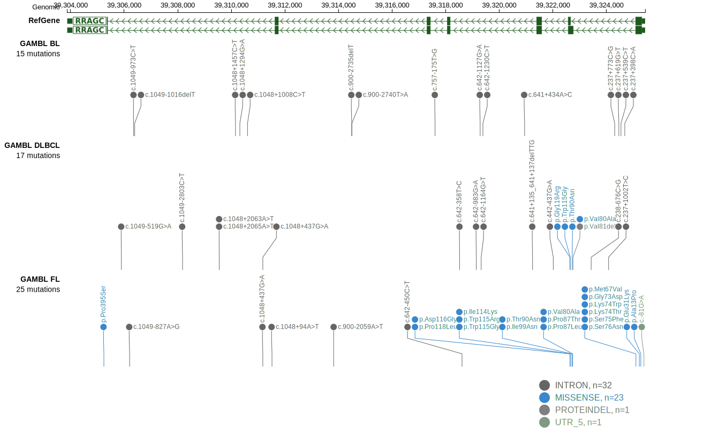

# RRAGC

## Relevance tier by entity

|Entity|Tier|Description               |
|:------:|:----:|--------------------------|
|DLBCL |1   |high-confidence DLBCL gene|
|FL    |1   |high-confidence FL gene   |

## Mutation incidence in large patient cohorts (GAMBL reanalysis)

|Entity|source        |frequency (%)|
|:------:|:--------------:|:-------------:|
|DLBCL |GAMBL genomes | 1.72        |
|DLBCL |Schmitz cohort| 2.98        |
|DLBCL |Reddy cohort  | 2.00        |
|DLBCL |Chapuy cohort | 0.43        |
|FL    |GAMBL genomes |10.85        |

## Mutation pattern and selective pressure estimates

|Entity|aSHM|Significant selection|dN/dS (missense)|dN/dS (nonsense)|
|:------:|:----:|:---------------------:|:----------------:|:----------------:|
|BL    |No  |No                   |  0.000         |0               |
|DLBCL |No  |No                   |  2.679         |0               |
|FL    |No  |Yes                  |163.715         |0               |

> [!NOTE]
> First described in DLBCL in 2016 by [Okosun J](https://pubmed.ncbi.nlm.nih.gov/26691987)

View coding variants in ProteinPaint [hg19](https://morinlab.github.io/LLMPP/GAMBL/RRAGC_protein.html)  or [hg38](https://morinlab.github.io/LLMPP/GAMBL/RRAGC_protein_hg38.html)

View all variants in GenomePaint [hg19](https://morinlab.github.io/LLMPP/GAMBL/RRAGC.html)  or [hg38](https://morinlab.github.io/LLMPP/GAMBL/RRAGC_hg38.html)

## RRAGC Expression

