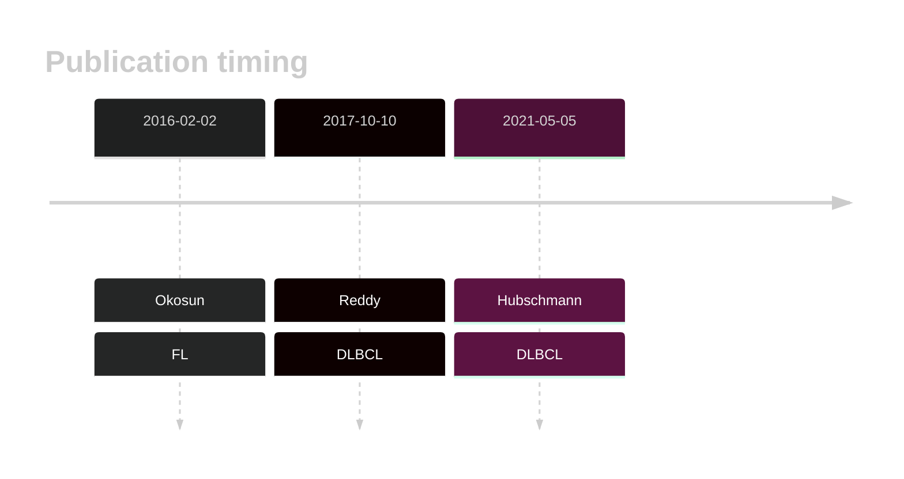

# RRAGC

## History

## Relevance tier by entity

|Entity|Tier|Description               |
|:------:|:----:|--------------------------|
| |1   |high-confidence DLBCL gene[@reddyGeneticFunctionalDrivers2017;@hubschmannMutationalMechanismsShaping2021b ]|
|    |1   |high-confidence FL gene  [@okosunRecurrentMTORC1activatingRRAGC2016] |

## Mutation incidence in large patient cohorts (GAMBL reanalysis)

[[include:DLBCL_RRAGC.md]]
[[include:FL_RRAGC.md]]

## Mutation pattern and selective pressure estimates

[[include:dnds_RRAGC.md]]

View coding variants in ProteinPaint [hg19](https://morinlab.github.io/LLMPP/GAMBL/RRAGC_protein.html)  or [hg38](https://morinlab.github.io/LLMPP/GAMBL/RRAGC_protein_hg38.html)

View all variants in GenomePaint [hg19](https://morinlab.github.io/LLMPP/GAMBL/RRAGC.html)  or [hg38](https://morinlab.github.io/LLMPP/GAMBL/RRAGC_hg38.html)

## RRAGC Expression

<!-- ORIGIN: okosunRecurrentMTORC1activatingRRAGC2016a -->
<!-- DLBCL: okosunRecurrentMTORC1activatingRRAGC2016a -->

## References

