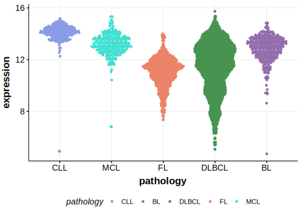

# RUBCNL

## Relevance tier by entity

|Entity|Tier|Description                              |
|:------:|:----:|-----------------------------------------|
| |2   |relevance in DLBCL not firmly established|

## Mutation incidence in large patient cohorts (GAMBL reanalysis)

|Entity|source        |frequency (%)|
|:------:|:--------------:|:-------------:|
|DLBCL |GAMBL genomes |0.57         |
|DLBCL |Schmitz cohort|  NA         |
|DLBCL |Reddy cohort  |  NA         |
|DLBCL |Chapuy cohort |  NA         |

## Mutation pattern and selective pressure estimates

|

## RUBCNL Expression

<!-- ORIGIN: Unknown -->

## References
