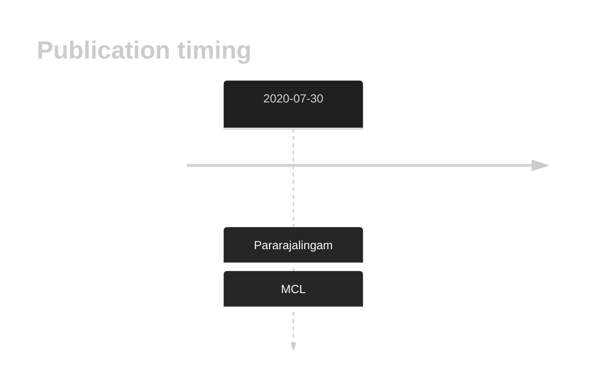
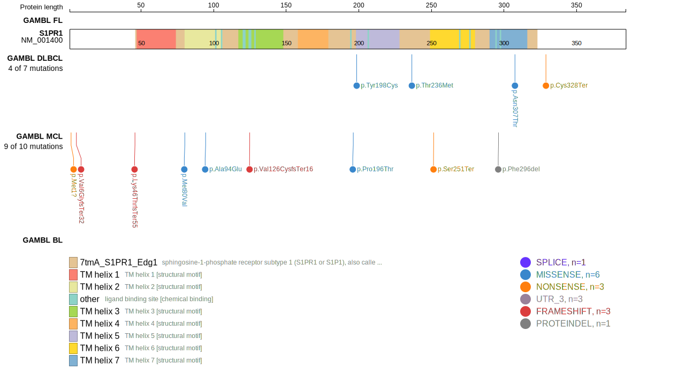
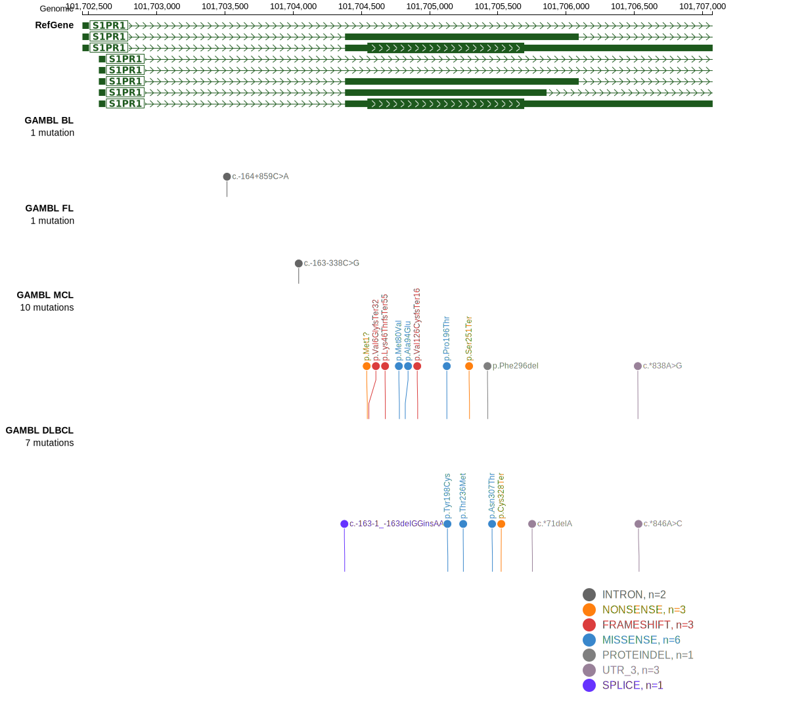

# S1PR1

## History

## Relevance tier by entity

|Entity|Tier|Description             |
|:------:|:----:|------------------------|
|   |1   |high-confidence MCL gene|

## Mutation incidence in large patient cohorts (GAMBL reanalysis)

|Entity|source       |frequency (%)|
|:------:|:-------------:|:-------------:|
|MCL   |GAMBL genomes|5.69         |

## Mutation pattern and selective pressure estimates

|Entity|aSHM|Significant selection|dN/dS (missense)|dN/dS (nonsense)|
|:------:|:----:|:---------------------:|:----------------:|:----------------:|
|BL    |No  |No                   |1.815           |0               |
|DLBCL |No  |No                   |2.579           |0               |
|FL    |No  |No                   |0.000           |0               |

View coding variants in ProteinPaint [hg19](https://morinlab.github.io/LLMPP/GAMBL/S1PR1_protein.html)  or [hg38](https://morinlab.github.io/LLMPP/GAMBL/S1PR1_protein_hg38.html)

View all variants in GenomePaint [hg19](https://morinlab.github.io/LLMPP/GAMBL/S1PR1.html)  or [hg38](https://morinlab.github.io/LLMPP/GAMBL/S1PR1_hg38.html)

## S1PR1 Expression

<!-- ORIGIN: pararajalingamCodingNoncodingDrivers2020 -->
<!-- MCL: pararajalingamCodingNoncodingDrivers2020 -->

## References
1.  Pararajalingam P, Coyle KM, Arthur SE, Thomas N, Alcaide M, Meissner B, Boyle M, Qureshi Q, Grande BM, Rushton C, Slack GW, Mungall AJ, Tam CS, Agarwal R, Dawson SJ, Lenz G, Balasubramanian S, Gascoyne RD, Steidl C, Connors J, Villa D, Audas TE, Marra MA, Johnson NA, Scott DW, Morin RD. Coding and noncoding drivers of mantle cell lymphoma identified through exome and genome sequencing. Blood. 2020 Jul 30;136(5):572–584. PMCID: PMC7440974
