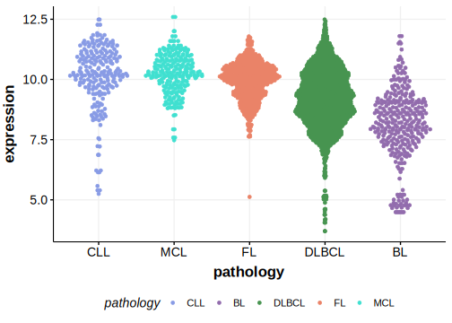

[[_TOC_]]

## Relevance tier by entity

[[include:table1_S1PR1.md]]

## Mutation incidence in large patient cohorts (GAMBL reanalysis)

|Entity|source       |frequency (%)|
|:------:|:-------------:|:-------------:|
|MCL   |GAMBL genomes|5.69         |

## Mutation pattern and selective pressure estimates

[[include:tables/dnds_S1PR1.md]]

[[include:browser_S1PR1.md]]

## Expression

<!-- ORIGIN: lohrDiscoveryPrioritizationSomatic2012a -->
<!-- MCL: pararajalingamCodingNoncodingDrivers2020 -->
<!-- DLBCL: lohrDiscoveryPrioritizationSomatic2012a -->

[[include:tables/mermaid_S1PR1.md]]

## References

