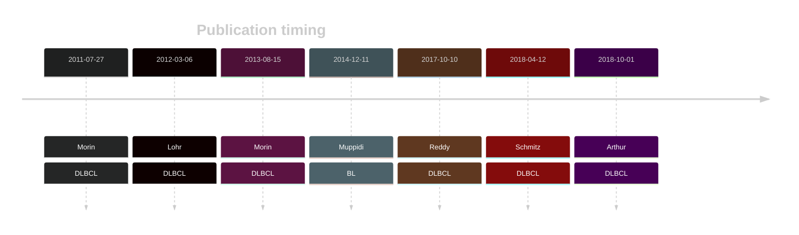
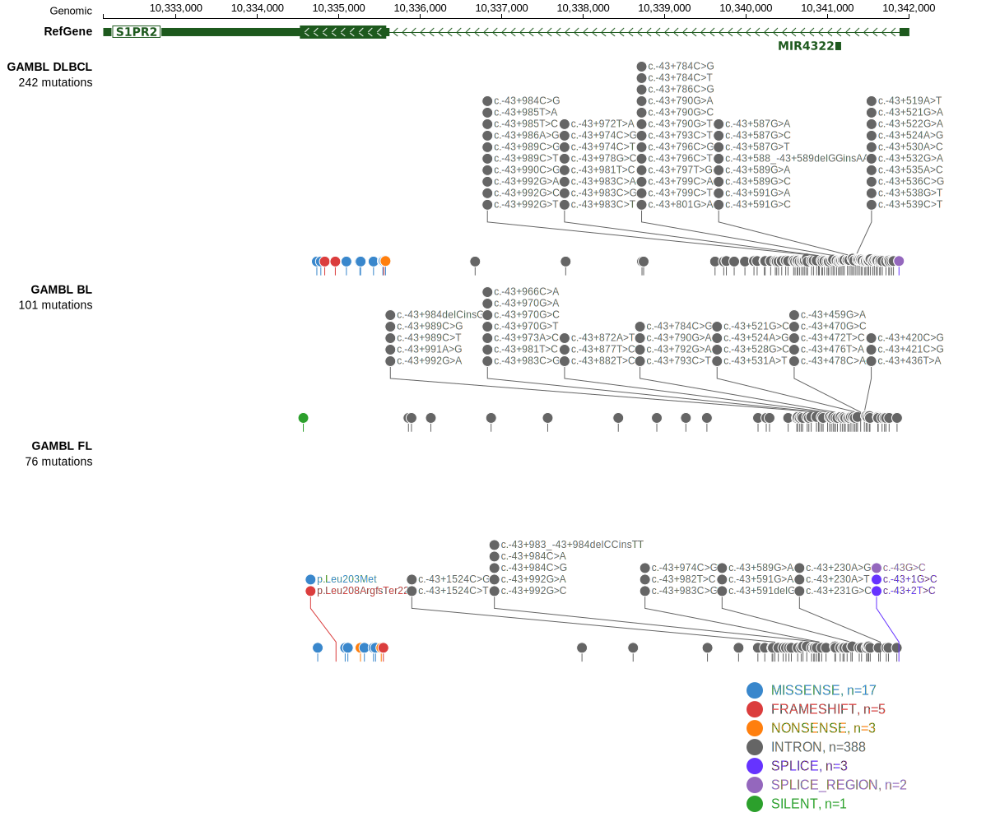
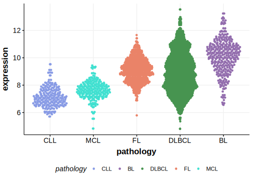

# S1PR2

## Overview
S1PR2 is one of [a number of genes](https://github.com/morinlab/LLMPP/wiki/ashm) affected by aberrant somatic hypermutation in B-cell lymphomas, which complicates the interpretation of mutations at this locus.

## History

## Relevance tier by entity

|Entity|Tier|Description                           |
|:------:|:----:|--------------------------------------|
||1|high-confidence PMBL/cHL/GZL gene|
|    |2 | aSHM target; Although recurrent, the relevance of mutations in BL is tenuous [@muppidiLossSignalingGa132014]|
| |1 | aSHM target and high-confidence DLBCL gene            [@morinFrequentMutationHistonemodifying2011; @lohrDiscoveryPrioritizationSomatic2012; @morinMutationalStructuralAnalysis2013]|
|    |1 | aSHM target and high-confidence FL gene               |

## Mutation incidence in large patient cohorts (GAMBL reanalysis)

[[include:DLBCL_S1PR2.md]]
[[include:FL_S1PR2.md]]
[[include:BL_S1PR2.md]]

## Mutation pattern and selective pressure estimates

[[include:dnds_S1PR2.md]]

## aSHM regions

|chr_name|hg19_start|hg19_end|region                                                                                    |regulatory_comment|
|:--------:|:----------:|:--------:|:------------------------------------------------------------------------------------------:|:------------------:|
|chr19   |10340142  |10341764|[TSS](https://genome.ucsc.edu/s/rdmorin/GAMBL%20hg19?position=chr19%3A10340142%2D10341764)|active_promoter   |

View coding variants in ProteinPaint [hg19](https://morinlab.github.io/LLMPP/GAMBL/S1PR2_protein.html)  or [hg38](https://morinlab.github.io/LLMPP/GAMBL/S1PR2_protein_hg38.html)

View all variants in GenomePaint [hg19](https://morinlab.github.io/LLMPP/GAMBL/S1PR2.html)  or [hg38](https://morinlab.github.io/LLMPP/GAMBL/S1PR2_hg38.html)

## S1PR2 Expression

<!-- ORIGIN: 21796119 -->
<!-- BL: muppidiLossSignalingGa132014b -->
<!-- DLBCL: morinFrequentMutationHistonemodifying2011 -->

## References

