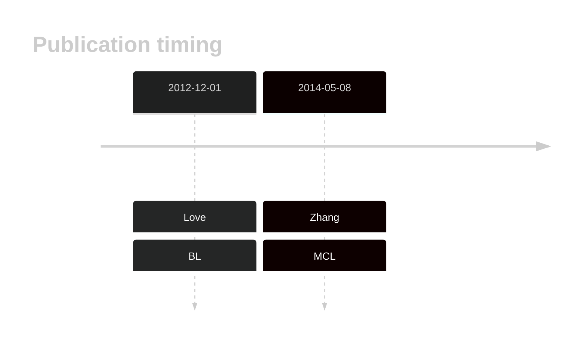

# SALL3

<<Warn("The variants reported in this gene in BL failed QC")>>

## History

## Relevance tier by entity

|Entity|Tier|Description                            |
|:------:|:----:|---------------------------------------|
|    |3   |Retired, Failed QC[@loveGeneticLandscapeMutations2012]|
|   |2   |relevance in MCL not firmly established[@zhangGenomicLandscapeMantle2014]|

## Mutation incidence in large patient cohorts (GAMBL reanalysis)

|Entity|source               |frequency (%)|
|:------:|:---------------------:|:-------------:|
|BL    |GAMBL genomes+capture|4.16         |
|BL    |Thomas cohort        |  NA         |
|BL    |Panea cohort         |  NA         |
|MCL   |GAMBL genomes        |0.95         |

## Mutation pattern and selective pressure estimates

|Entity|aSHM|Significant selection|dN/dS (missense)|dN/dS (nonsense)|
|:------:|:----:|:---------------------:|:----------------:|:----------------:|
|BL    |No  |No                   |1.641           | 0.000          |
|DLBCL |No  |No                   |1.052           |13.148          |
|FL    |No  |No                   |1.660           | 0.000          |

View coding variants in ProteinPaint [hg19](https://morinlab.github.io/LLMPP/GAMBL/SALL3_protein.html)  or [hg38](https://morinlab.github.io/LLMPP/GAMBL/SALL3_protein_hg38.html)

View all variants in GenomePaint [hg19](https://morinlab.github.io/LLMPP/GAMBL/SALL3.html)  or [hg38](https://morinlab.github.io/LLMPP/GAMBL/SALL3_hg38.html)

## SALL3 Expression

<!-- ORIGIN: loveGeneticLandscapeMutations2012 -->
<!-- MCL: zhangGenomicLandscapeMantle2014 -->
<!-- BL: loveGeneticLandscapeMutations2012 -->

## Representative Mutations

**Rating**
&starf; &starf; &star; &star; &star;

## All Mutations

[1096](https://www.bcgsc.ca/downloads/morinlab/GAMBL/Love/1096_reports.html)
[475](https://www.bcgsc.ca/downloads/morinlab/GAMBL/Love/475_reports.html)
[513](https://www.bcgsc.ca/downloads/morinlab/GAMBL/Love/513_reports.html)
[515](https://www.bcgsc.ca/downloads/morinlab/GAMBL/Love/515_reports.html)

## References

