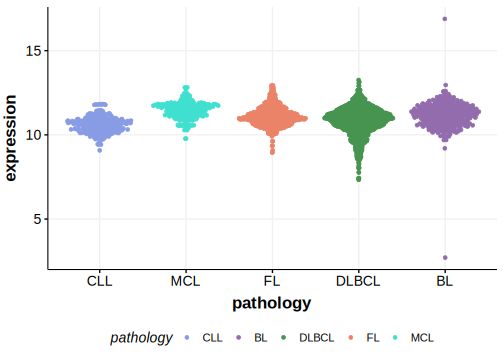

[[_TOC_]]

## Relevance tier by entity

|Entity|Tier|Description                           |
|:------:|:----:|--------------------------------------|
|    |2   |relevance in BL not firmly established[@loveGeneticLandscapeMutations2012]|

## Mutation incidence in large patient cohorts (GAMBL reanalysis)

|Entity|source               |frequency (%)|
|:------:|:---------------------:|:-------------:|
|BL    |GAMBL genomes+capture|4.85         |
|BL    |Thomas cohort        |  NA         |
|BL    |Panea cohort         |  NA         |

## Mutation pattern and selective pressure estimates

|Entity|aSHM|Significant selection|dN/dS (missense)|dN/dS (nonsense)|
|:------:|:----:|:---------------------:|:----------------:|:----------------:|
|BL    |No  |No                   |0.613           | 0.000          |
|DLBCL |No  |No                   |2.003           |12.038          |
|FL    |No  |No                   |1.554           |19.971          |

View coding variants in ProteinPaint [hg19](https://morinlab.github.io/LLMPP/GAMBL/SBF1_protein.html)  or [hg38](https://morinlab.github.io/LLMPP/GAMBL/SBF1_protein_hg38.html)

View all variants in GenomePaint [hg19](https://morinlab.github.io/LLMPP/GAMBL/SBF1.html)  or [hg38](https://morinlab.github.io/LLMPP/GAMBL/SBF1_hg38.html)

## SBF1 Expression

<!-- ORIGIN: loveGeneticLandscapeMutations2012 -->
<!-- BL: loveGeneticLandscapeMutations2012 -->

## Representative Mutation

**Rating**
&starf; &starf; &star; &star; &star;

[[include:mermaid_SBF1.md]]

## References

