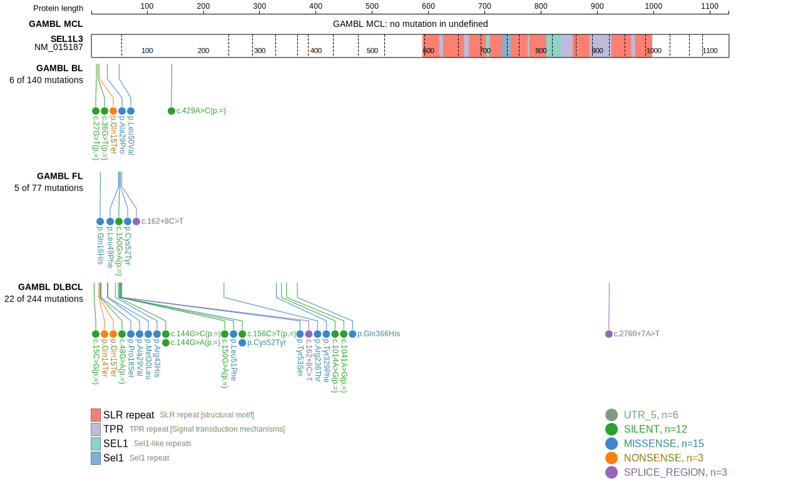
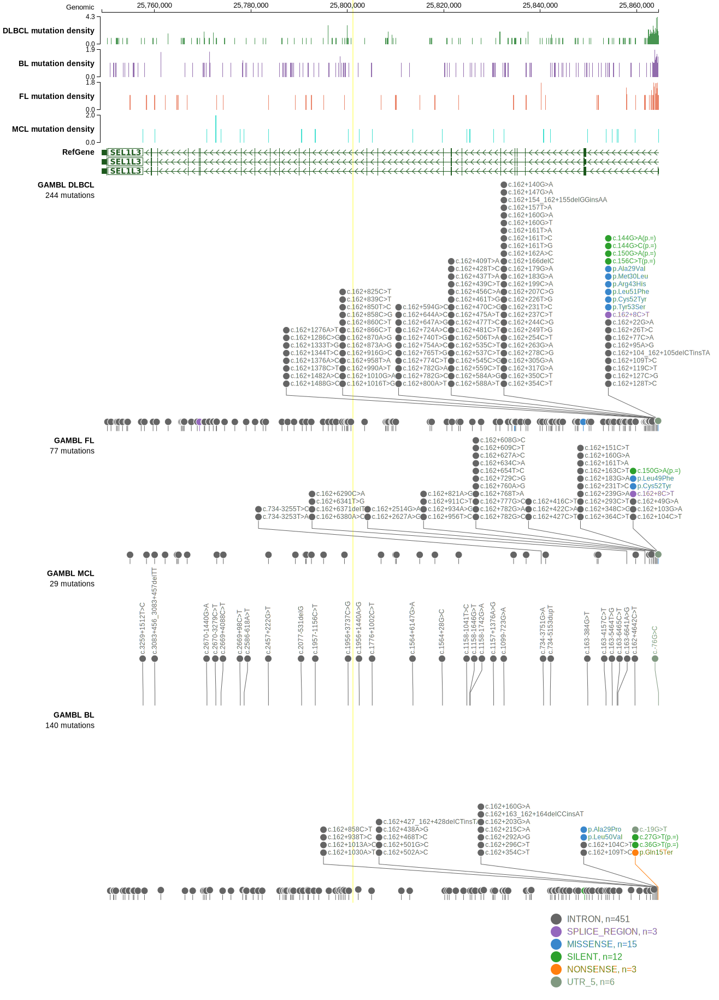
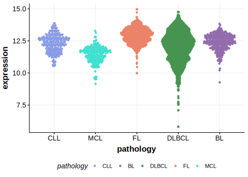

# SEL1L3

## Relevance tier by entity

|Entity|Tier|Description                              |
|:------:|:----:|-----------------------------------------|
| |2-a | aSHM target; Although recurrent, the relevance of mutations in DLBCL is tenuous |

## Mutation incidence in large patient cohorts (GAMBL reanalysis)

|Entity|source        |frequency (%)|
|:------:|:--------------:|:-------------:|
|DLBCL |GAMBL genomes |5.16         |
|DLBCL |Schmitz cohort|4.04         |
|DLBCL |Reddy cohort  |2.20         |
|DLBCL |Chapuy cohort |  NA         |

## Mutation pattern and selective pressure estimates

[[include:dnds_SEL1L3.md]]

## aSHM regions

|chr_name|hg19_start|hg19_end|region                                                                                   |regulatory_comment|
|:--------:|:----------:|:--------:|:-----------------------------------------------------------------------------------------:|:------------------:|
|chr4    |25861094  |25868788|[TSS](https://genome.ucsc.edu/s/rdmorin/GAMBL%20hg19?position=chr4%3A25861094%2D25868788)|NA                |

View coding variants in ProteinPaint [hg19](https://morinlab.github.io/LLMPP/GAMBL/SEL1L3_protein.html)  or [hg38](https://morinlab.github.io/LLMPP/GAMBL/SEL1L3_protein_hg38.html)

View all variants in GenomePaint [hg19](https://morinlab.github.io/LLMPP/GAMBL/SEL1L3.html)  or [hg38](https://morinlab.github.io/LLMPP/GAMBL/SEL1L3_hg38.html)

## SEL1L3 Expression

<!-- ORIGIN: Unknown -->

## References
