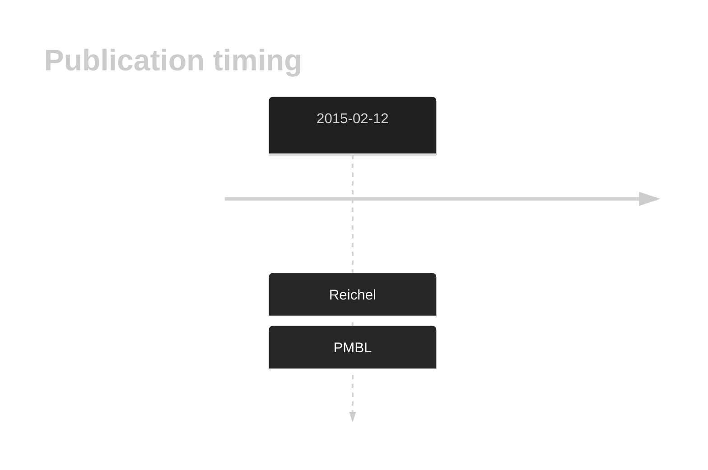

# SENP7

## History

## Relevance tier by entity

|Entity|Tier|Description|
|:------:|:----:|--------------------------------------|
||2|relevance in PMBL/cHL/GZL not firmly established[@reichelFlowSortingExome2015]|

## Mutation incidence in large patient cohorts (GAMBL reanalysis)

|Entity|source |frequency (%)|
|:------:|:----:|:----:|
|BL|GAMBL Exome |2.874 |
|BL|GAMBL Genome |0.386 |
|DLBCL|GAMBL Exome |1.509 |
|DLBCL|GAMBL Genome |0.564 |

## References

