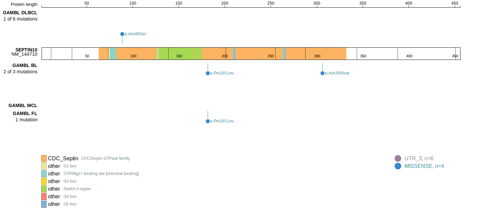
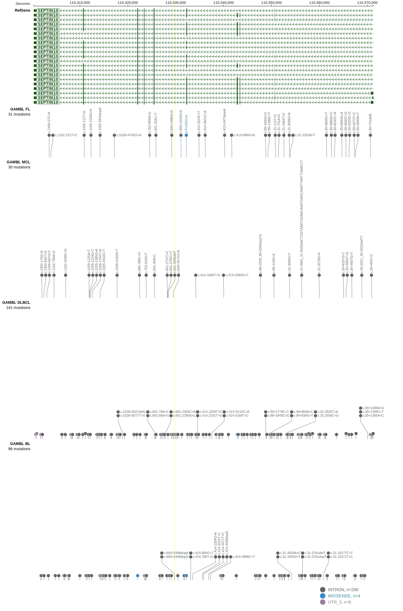

# SEPT10

## Relevance tier by entity

|Entity|Tier|Description                           |
|:------:|:----:|--------------------------------------|
|BL    |2   |relevance in BL not firmly established|

## Mutation incidence in large patient cohorts (GAMBL reanalysis)

|Entity|source               |frequency (%)|
|:------:|:---------------------:|:-------------:|
|BL    |GAMBL genomes+capture|0.92         |
|BL    |Thomas cohort        |2.10         |
|BL    |Panea cohort         |2.00         |

## Mutation pattern and selective pressure estimates

|Entity|aSHM|Significant selection|dN/dS (missense)|dN/dS (nonsense)|
|:------:|:----:|:---------------------:|:----------------:|:----------------:|
|BL    |No  |No                   |7.224           |13.447          |
|DLBCL |No  |No                   |0.000           | 0.000          |
|FL    |No  |No                   |2.834           | 0.000          |

View coding variants in ProteinPaint [hg19](https://morinlab.github.io/LLMPP/GAMBL/SEPT10_protein.html)  or [hg38](https://morinlab.github.io/LLMPP/GAMBL/SEPT10_protein_hg38.html)

View all variants in GenomePaint [hg19](https://morinlab.github.io/LLMPP/GAMBL/SEPT10.html)  or [hg38](https://morinlab.github.io/LLMPP/GAMBL/SEPT10_hg38.html)

## SEPT10 Expression

<!-- ORIGIN: Unknown -->
