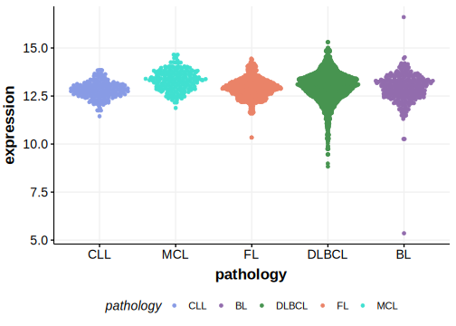

# SEPTIN9

## Relevance tier by entity

|Entity|Tier|Description                              |
|:------:|:----:|-----------------------------------------|
| |2   |relevance in DLBCL not firmly established|

## Mutation incidence in large patient cohorts (GAMBL reanalysis)

|Entity|source        |frequency (%)|
|:------:|:--------------:|:-------------:|
|DLBCL |GAMBL genomes |NA           |
|DLBCL |Schmitz cohort|NA           |
|DLBCL |Reddy cohort  |NA           |
|DLBCL |Chapuy cohort |NA           |

## Mutation pattern and selective pressure estimates

|

## aSHM regions

|chr_name|hg19_start|hg19_end|region                                                                                         |regulatory_comment|
|:--------:|:----------:|:--------:|:-----------------------------------------------------------------------------------------------:|:------------------:|
|chr17   |75424734  |75440956|[intron-1](https://genome.ucsc.edu/s/rdmorin/GAMBL%20hg19?position=chr17%3A75424734%2D75440956)|active_promoter   |
|chr17   |75443766  |75451177|[intron-2](https://genome.ucsc.edu/s/rdmorin/GAMBL%20hg19?position=chr17%3A75443766%2D75451177)|active_promoter   |
|chr17   |75453203  |75471471|[intron-3](https://genome.ucsc.edu/s/rdmorin/GAMBL%20hg19?position=chr17%3A75453203%2D75471471)|active_promoter   |
## SEPTIN9 Expression

<!-- ORIGIN: Unknown -->

## References
