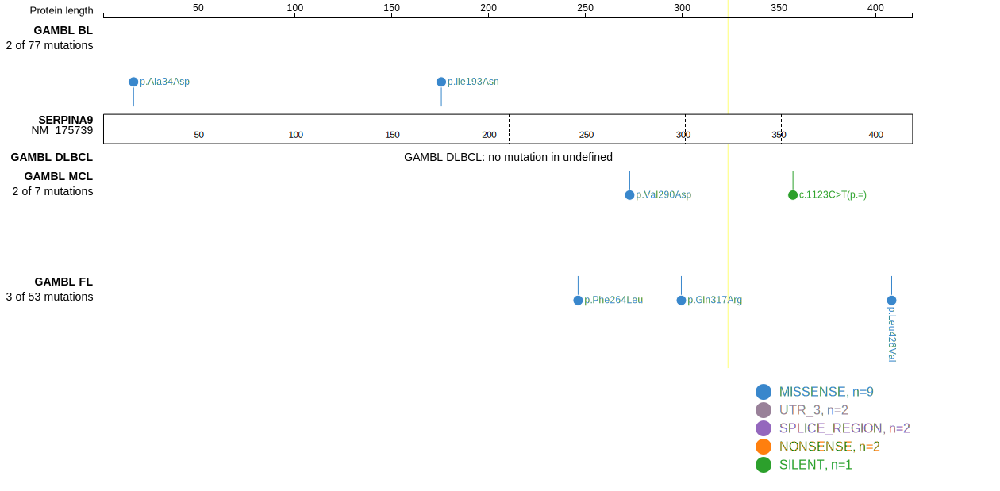
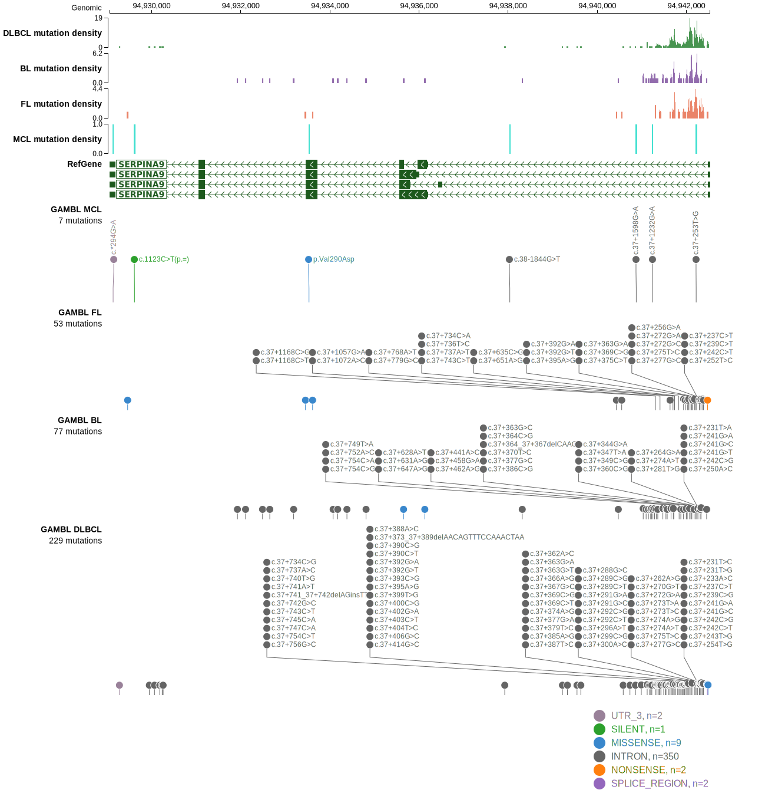

# SERPINA9

## Relevance tier by entity

|Entity|Tier|Description                              |
|:------:|:----:|-----------------------------------------|
|DLBCL |2-a | aSHM target; Although recurrent, the relevance of mutations in DLBCL is tenuous |

## Mutation incidence in large patient cohorts (GAMBL reanalysis)

|Entity|source        |frequency (%)|
|:------:|:--------------:|:-------------:|
|DLBCL |GAMBL genomes |1.15         |
|DLBCL |Schmitz cohort|2.13         |
|DLBCL |Reddy cohort  |0.90         |
|DLBCL |Chapuy cohort |2.14         |

## Mutation pattern and selective pressure estimates

|Entity|aSHM|Significant selection|dN/dS (missense)|dN/dS (nonsense)|
|:------:|:----:|:---------------------:|:----------------:|:----------------:|
|BL    |Yes |No                   |4.866           | 0.000          |
|DLBCL |Yes |No                   |1.343           |39.076          |
|FL    |Yes |No                   |5.716           |42.861          |

## aSHM regions

|chr_name|hg19_start|hg19_end|region                                                                                    |regulatory_comment|
|:--------:|:----------:|:--------:|:------------------------------------------------------------------------------------------:|:------------------:|
|chr14   |94940587  |94942549|[TSS](https://genome.ucsc.edu/s/rdmorin/GAMBL%20hg19?position=chr14%3A94940587%2D94942549)|NA                |

> [!NOTE]
> First described in DLBCL in 2018 by [Arthur SE](https://pubmed.ncbi.nlm.nih.gov/30275490)

View coding variants in ProteinPaint [hg19](https://morinlab.github.io/LLMPP/GAMBL/SERPINA9_protein.html)  or [hg38](https://morinlab.github.io/LLMPP/GAMBL/SERPINA9_protein_hg38.html)

View all variants in GenomePaint [hg19](https://morinlab.github.io/LLMPP/GAMBL/SERPINA9.html)  or [hg38](https://morinlab.github.io/LLMPP/GAMBL/SERPINA9_hg38.html)

