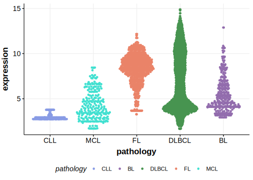

[[_TOC_]]

## Relevance tier by entity

[[include:tables/table1_SERPINA9.md]]

## Mutation incidence in large patient cohorts (GAMBL reanalysis)

|Entity|source        |frequency (%)|
|:------:|:--------------:|:-------------:|
|DLBCL |GAMBL genomes |1.15         |
|DLBCL |Schmitz cohort|2.13         |
|DLBCL |Reddy cohort  |0.90         |
|DLBCL |Chapuy cohort |2.14         |

## Mutation pattern and selective pressure estimates

[[include:tables/dnds_SERPINA9.md]]

## aSHM regions

|chr_name|hg19_start|hg19_end|region                                                                                    |regulatory_comment|
|:--------:|:----------:|:--------:|:------------------------------------------------------------------------------------------:|:------------------:|
|chr14   |94940587  |94942549|[TSS](https://genome.ucsc.edu/s/rdmorin/GAMBL%20hg19?position=chr14%3A94940587%2D94942549)|NA                |

[[include:browser_SERPINA9.md]]

## Expression

<!-- ORIGIN: arthurGenomewideDiscoverySomatic2018 -->
<!-- DLBCL: arthurGenomewideDiscoverySomatic2018 -->

[[include:tables/mermaid_SERPINA9.md]]

## References

