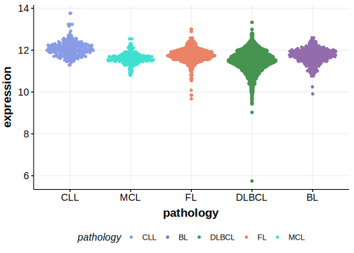

[[_TOC_]]

## Overview

Mutations in this gene were first described in DLBCL in 2013[@zhangGeneticHeterogeneityDiffuse2013] and by the same group in a subsequent study.[@reddyGeneticFunctionalDrivers2017] It remains in Tier 2 because other exome and genome-wide studies of DLBCL did not reproduce this observation. 

## Relevance tier by entity

[[include:tables/table1_SETD2.md]]

## Mutation incidence in large patient cohorts (GAMBL reanalysis)

|Entity|source        |frequency (%)|
|:------:|:--------------:|:-------------:|
|DLBCL |GAMBL genomes |3.63         |
|DLBCL |Schmitz cohort|6.38         |
|DLBCL |Reddy cohort  |4.60         |
|DLBCL |Chapuy cohort |0.43         |

## Mutation pattern and selective pressure estimates

[[include:tables/dnds_SETD2.md]]

[[include:tables/browser_SETD2.md]]

## Expression

<!-- ORIGIN: zhangGeneticHeterogeneityDiffuse2013 -->
<!-- DLBCL: zhangGeneticHeterogeneityDiffuse2013 -->

[[include:tables/mermaid_SETD2.md]]

## References

