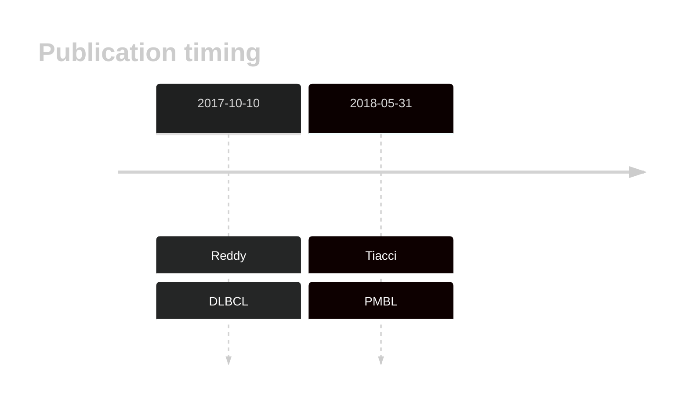

# SETD5

## History

## Relevance tier by entity

|Entity|Tier|Description                              |
|:------:|:----:|-----------------------------------------|
||2|relevance in PMBL/cHL/GZL not firmly established|
| |2   |relevance in DLBCL not firmly established|

## Mutation incidence in large patient cohorts (GAMBL reanalysis)

|Entity|source        |frequency (%)|
|:------:|:--------------:|:-------------:|
|DLBCL |GAMBL genomes |2.49         |
|DLBCL |Schmitz cohort|5.32         |
|DLBCL |Reddy cohort  |3.20         |
|DLBCL |Chapuy cohort |2.14         |

## Mutation pattern and selective pressure estimates

|Entity|aSHM|Significant selection|dN/dS (missense)|dN/dS (nonsense)|
|:------:|:----:|:---------------------:|:----------------:|:----------------:|
|BL    |No  |No                   |0.000           | 0.000          |
|DLBCL |No  |No                   |0.841           |32.108          |
|FL    |No  |No                   |2.236           | 0.000          |

> [!WARNING]
> Mutations in this gene were reported to be inflated in the original results according to [Dreval K](https://www.biorxiv.org/content/10.1101/2023.11.21.567983v1)

View coding variants in ProteinPaint [hg19](https://morinlab.github.io/LLMPP/GAMBL/SETD5_protein.html)  or [hg38](https://morinlab.github.io/LLMPP/GAMBL/SETD5_protein_hg38.html)

View all variants in GenomePaint [hg19](https://morinlab.github.io/LLMPP/GAMBL/SETD5.html)  or [hg38](https://morinlab.github.io/LLMPP/GAMBL/SETD5_hg38.html)

## SETD5 Expression

<!-- ORIGIN: reddyGeneticFunctionalDrivers2017 -->
<!-- DLBCL: reddyGeneticFunctionalDrivers2017 -->
<!-- PMBL: tiacciPervasiveMutationsJAKSTAT2018b -->

## References
1.  Reddy A, Zhang J, Davis NS, Moffitt AB, Love CL, Waldrop A, Leppa S, Pasanen A, Meriranta L, Karjalainen-Lindsberg ML, Nørgaard P, Pedersen M, Gang AO, Høgdall E, Heavican TB, Lone W, Iqbal J, Qin Q, Li G, Kim SY, Healy J, Richards KL, Fedoriw Y, Bernal-Mizrachi L, Koff JL, Staton AD, Flowers CR, Paltiel O, Goldschmidt N, Calaminici M, Clear A, Gribben J, Nguyen E, Czader MB, Ondrejka SL, Collie A, Hsi ED, Tse E, Au-Yeung RKH, Kwong YL, Srivastava G, Choi WWL, Evens AM, Pilichowska M, Sengar M, Reddy N, Li S, Chadburn A, Gordon LI, Jaffe ES, Levy S, Rempel R, Tzeng T, Happ LE, Dave T, Rajagopalan D, Datta J, Dunson DB, Dave SS. Genetic and Functional Drivers of Diffuse Large B Cell Lymphoma. Cell. 2017 Oct;171(2):481-494.e15. 
2.  Tiacci E, Ladewig E, Schiavoni G, Penson A, Fortini E, Pettirossi V, Wang Y, Rosseto A, Venanzi A, Vlasevska S, Pacini R, Piattoni S, Tabarrini A, Pucciarini A, Bigerna B, Santi A, Gianni AM, Viviani S, Cabras A, Ascani S, Crescenzi B, Mecucci C, Pasqualucci L, Rabadan R, Falini B. Pervasive mutations of JAK-STAT pathway genes in classical Hodgkin lymphoma. Blood. 2018 May 31;131(22):2454–2465. PMCID: PMC6634958
