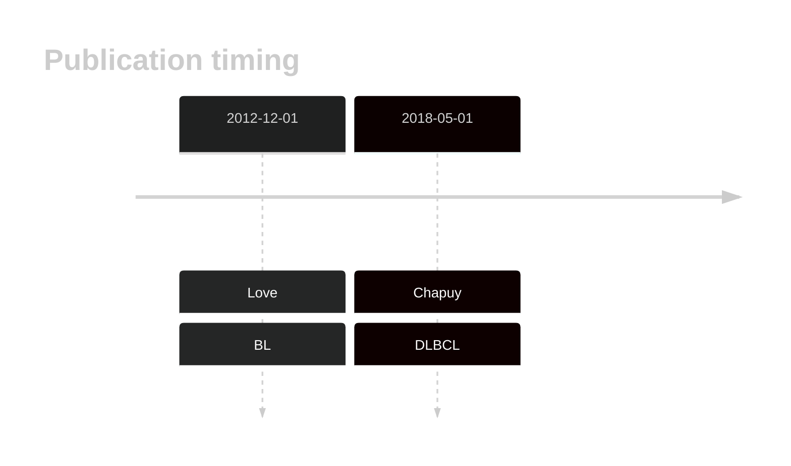
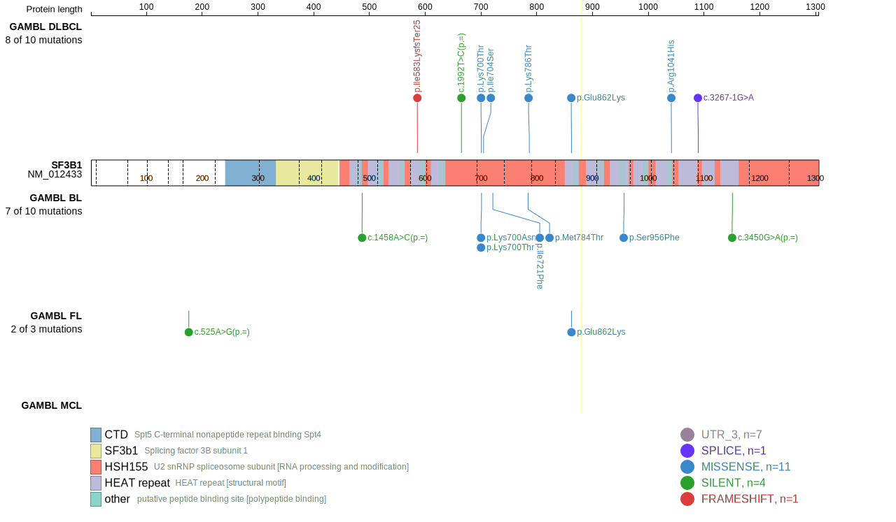
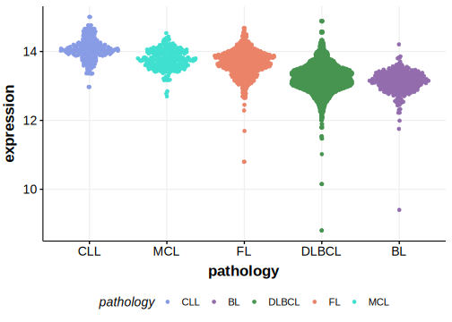
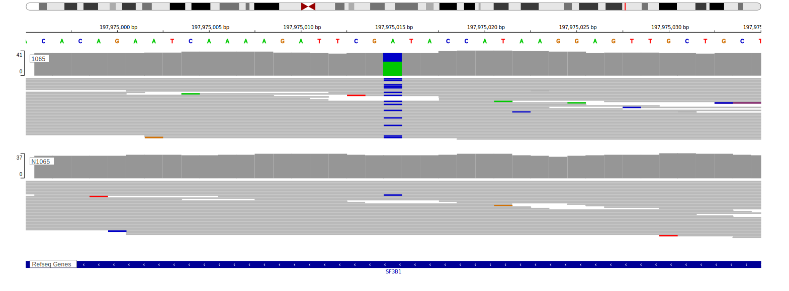

# SF3B1

<<Warn("The variants reported in this gene failed QC")>>

## History

## Relevance tier by entity

|Entity|Tier|Description                           |
|:------:|:----:|--------------------------------------|
|    |3   |Retired, Failed QC[@loveGeneticLandscapeMutations2012]|
| |1   |high-confidence DLBCL gene           [@reddyGeneticFunctionalDrivers2017; @chapuyMolecularSubtypesDiffuse2018b] |

## Mutation incidence in large patient cohorts (GAMBL reanalysis)

|Entity|source               |frequency (%)|
|:------:|:---------------------:|:-------------:|
|BL    |GAMBL genomes+capture|3.00         |
|BL    |Thomas cohort        |  NA         |
|BL    |Panea cohort         |  NA         |
|DLBCL |GAMBL genomes        |2.87         |
|DLBCL |Schmitz cohort       |2.13         |
|DLBCL |Reddy cohort         |2.00         |
|DLBCL |Chapuy cohort        |2.99         |

## Mutation pattern and selective pressure estimates

|Entity|aSHM|Significant selection|dN/dS (missense)|dN/dS (nonsense)|
|:------:|:----:|:---------------------:|:----------------:|:----------------:|
|BL    |No  |No                   |2.277           |0.000           |
|DLBCL |No  |No                   |3.245           |7.004           |
|FL    |No  |No                   |2.408           |0.000           |

## SF3B1 Hotspots

| Chromosome |Coordinate (hg19) | ref>alt | HGVSp | 
 | :---:| :---: | :--: | :---: |
| chr2 | 198266833 | T>G | K700T |
| chr2 | 198266832 | T>G | K700N |
| chr2 | 198266821 | A>C | I704S |

View coding variants in ProteinPaint [hg19](https://morinlab.github.io/LLMPP/GAMBL/SF3B1_protein.html)  or [hg38](https://morinlab.github.io/LLMPP/GAMBL/SF3B1_protein_hg38.html)

View all variants in GenomePaint [hg19](https://morinlab.github.io/LLMPP/GAMBL/SF3B1.html)  or [hg38](https://morinlab.github.io/LLMPP/GAMBL/SF3B1_hg38.html)

## SF3B1 Expression

<!-- ORIGIN: loveGeneticLandscapeMutations2012 -->
<!-- BL: loveGeneticLandscapeMutations2012 -->

## Representative Mutations

### BL

**Rating**
&starf; &starf; &starf; &starf; &star;

## References

