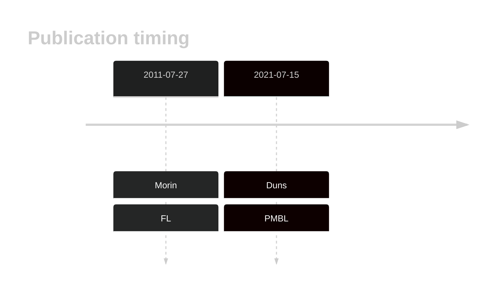

# SGK1

## History

## Relevance tier by entity

|Entity|Tier|Description                           |
|:------:|:----:|--------------------------------------|
||1|high-confidence PMBL/cHL/GZL gene|
| |1-a | aSHM target and high-confidence DLBCL gene            |
|    |1-a | aSHM target and high-confidence FL gene               |

## Mutation incidence in large patient cohorts (GAMBL reanalysis)

|Entity|source               |frequency (%)|
|:------:|:---------------------:|:-------------:|
|DLBCL |GAMBL genomes        |11.09        |
|DLBCL |Schmitz cohort       |10.64        |
|DLBCL |Reddy cohort         |11.21        |
|DLBCL |Chapuy cohort        |12.82        |
|FL    |GAMBL genomes        | 6.00        |

## Mutation pattern and selective pressure estimates

|Entity|aSHM|Significant selection|dN/dS (missense)|dN/dS (nonsense)|
|:------:|:----:|:---------------------:|:----------------:|:----------------:|
|BL    |Yes |No                   | 5.451          |  7.487         |
|DLBCL |Yes |Yes                  | 6.056          | 13.755         |
|FL    |Yes |Yes                  |23.198          |134.356         |

## aSHM regions

|chr_name|hg19_start|hg19_end |region                                                                                       |regulatory_comment|
|:--------:|:----------:|:---------:|:---------------------------------------------------------------------------------------------:|:------------------:|
|chr6    |134487960 |134499859|[TSS-1](https://genome.ucsc.edu/s/rdmorin/GAMBL%20hg19?position=chr6%3A134487960%2D134499859)|active_promoter   |

View coding variants in ProteinPaint [hg19](https://morinlab.github.io/LLMPP/GAMBL/SGK1_protein.html)  or [hg38](https://morinlab.github.io/LLMPP/GAMBL/SGK1_protein_hg38.html)

View all variants in GenomePaint [hg19](https://morinlab.github.io/LLMPP/GAMBL/SGK1.html)  or [hg38](https://morinlab.github.io/LLMPP/GAMBL/SGK1_hg38.html)

## References
1. *Morin RD, Mendez-Lago M, Mungall AJ, Goya R, Mungall KL, Corbett RD, Johnson NA, Severson TM, Chiu R, Field M, Jackman S, Krzywinski M, Scott DW, Trinh DL, Tamura-Wells J, Li S, Firme MR, Rogic S, Griffith M, Chan S, Yakovenko O, Meyer IM, Zhao EY, Smailus D, Moksa M, Chittaranjan S, Rimsza L, Brooks-Wilson A, Spinelli JJ, Ben-Neriah S, Meissner B, Woolcock B, Boyle M, McDonald H, Tam A, Zhao Y, Delaney A, Zeng T, Tse K, Butterfield Y, Birol I, Holt R, Schein J, Horsman DE, Moore R, Jones SJ, Connors JM, Hirst M, Gascoyne RD, Marra MA. Frequent mutation of histone-modifying genes in non-Hodgkin lymphoma. Nature. 2011 Jul 27;476(7360):298-303. doi: 10.1038/nature10351. PMID: 21796119; PMCID: PMC3210554.*

## SGK1 Expression

<!-- ORIGIN: morinFrequentMutationHistonemodifying2011 -->
<!-- FL: morinFrequentMutationHistonemodifying2011 -->
<!-- PMBL: dunsCharacterizationDLBCLPMBL2021b -->
<!-- DLBCL: morinFrequentMutationHistonemodifying2011 -->
