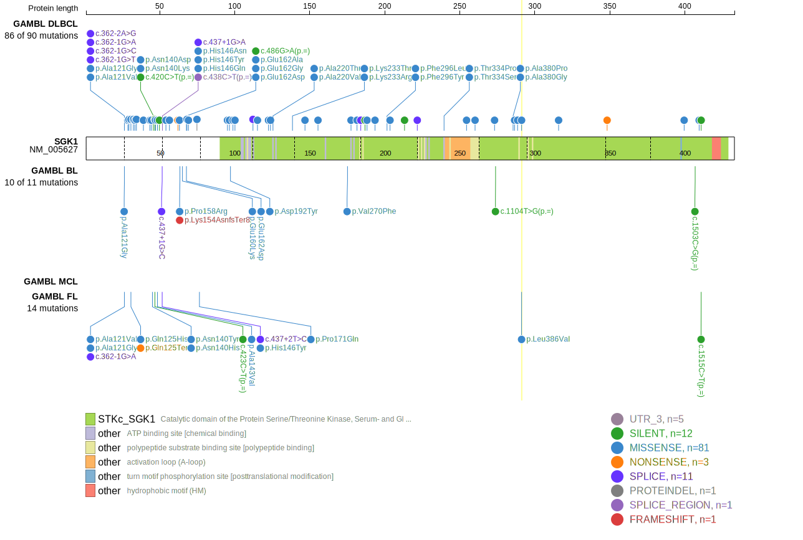
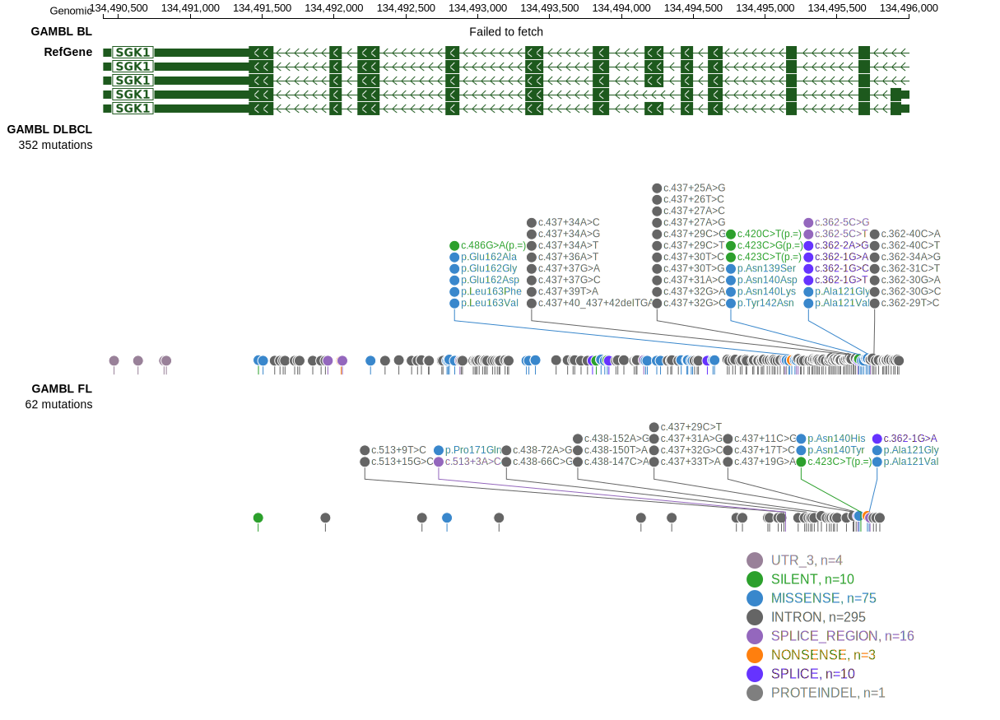

# SGK1

## Relevance tier by entity

|Entity|Tier|Description                           |
|:------:|:----:|--------------------------------------|
|BL    |2-a | aSHM target; Although recurrent, the relevance of mutations in BL is tenuous |
|DLBCL |1-a | aSHM target and high-confidence DLBCL gene            |
|FL    |1-a | aSHM target and high-confidence FL gene               |

## Mutation incidence in large patient cohorts (GAMBL reanalysis)

|Entity|source               |frequency (%)|
|:------:|:---------------------:|:-------------:|
|BL    |GAMBL genomes+capture| 2.08        |
|BL    |Thomas cohort        | 2.50        |
|BL    |Panea cohort         | 4.00        |
|DLBCL |GAMBL genomes        |11.09        |
|DLBCL |Schmitz cohort       |10.64        |
|DLBCL |Reddy cohort         |11.21        |
|DLBCL |Chapuy cohort        |12.82        |
|FL    |GAMBL genomes        | 6.00        |

## Mutation pattern and selective pressure estimates

|Entity|aSHM|Significant selection|dN/dS (missense)|dN/dS (nonsense)|
|:------:|:----:|:---------------------:|:----------------:|:----------------:|
|BL    |Yes |No                   | 5.451          |  7.487         |
|DLBCL |Yes |Yes                  | 6.056          | 13.755         |
|FL    |Yes |Yes                  |23.198          |134.356         |

## aSHM regions

|chr_name|hg19_start|hg19_end |region                                                                                       |regulatory_comment|
|:--------:|:----------:|:---------:|:---------------------------------------------------------------------------------------------:|:------------------:|
|chr6    |134487960 |134499859|[TSS-1](https://genome.ucsc.edu/s/rdmorin/GAMBL%20hg19?position=chr6%3A134487960%2D134499859)|active_promoter   |

> [!NOTE]
> First described in DLBCL in 2011 by [Morin RD](https://pubmed.ncbi.nlm.nih.gov/21796119). First described in FL in 2011 by [Morin RD](https://pubmed.ncbi.nlm.nih.gov/21796119)

View coding variants in ProteinPaint [hg19](https://www.bcgsc.ca/downloads/morinlab/GAMBL/test/genes/SGK1_protein.html)  or [hg38](https://www.bcgsc.ca/downloads/morinlab/GAMBL/test/genes/SGK1_protein_hg38.html)

View all variants in GenomePaint [hg19](https://www.bcgsc.ca/downloads/morinlab/GAMBL/test/genes/SGK1.html)  or [hg38](https://www.bcgsc.ca/downloads/morinlab/GAMBL/test/genes/SGK1_hg38.html)

