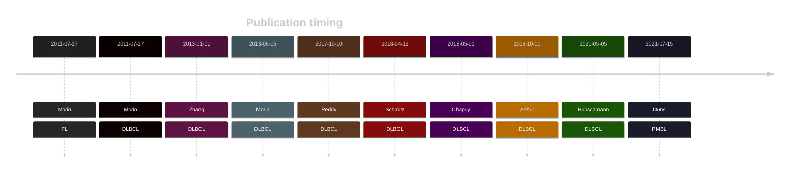

# SGK1

## History

## Relevance tier by entity

|Entity|Tier|Description                           |
|:------:|:----:|--------------------------------------|
||1|high-confidence PMBL/cHL/GZL gene[@dunsCharacterizationDLBCLPMBL2021b]|
| |1 | aSHM target and high-confidence DLBCL gene            [@morinFrequentMutationHistonemodifying2011]|
|    |1 | aSHM target and high-confidence FL gene               [@morinFrequentMutationHistonemodifying2011; @zhangGeneticHeterogeneityDiffuse2013; @morinMutationalStructuralAnalysis2013]|

## Mutation incidence in large patient cohorts (GAMBL reanalysis)

|Entity|source               |frequency (%)|
|:------:|:---------------------:|:-------------:|
|DLBCL |GAMBL genomes        |11.09        |
|DLBCL |Schmitz cohort       |10.64        |
|DLBCL |Reddy cohort         |11.21        |
|DLBCL |Chapuy cohort        |12.82        |
|FL    |GAMBL genomes        | 6.00        |

## Mutation pattern and selective pressure estimates

|Entity|aSHM|Significant selection|dN/dS (missense)|dN/dS (nonsense)|
|:------:|:----:|:---------------------:|:----------------:|:----------------:|
|BL    |Yes |No                   | 5.451          |  7.487         |
|DLBCL |Yes |Yes                  | 6.056          | 13.755         |
|FL    |Yes |Yes                  |23.198          |134.356         |

## aSHM regions

|chr_name|hg19_start|hg19_end |region                                                                                       |regulatory_comment|
|:--------:|:----------:|:---------:|:---------------------------------------------------------------------------------------------:|:------------------:|
|chr6    |134487960 |134499859|[TSS-1](https://genome.ucsc.edu/s/rdmorin/GAMBL%20hg19?position=chr6%3A134487960%2D134499859)|active_promoter   |

View coding variants in ProteinPaint [hg19](https://morinlab.github.io/LLMPP/GAMBL/SGK1_protein.html)  or [hg38](https://morinlab.github.io/LLMPP/GAMBL/SGK1_protein_hg38.html)

View all variants in GenomePaint [hg19](https://morinlab.github.io/LLMPP/GAMBL/SGK1.html)  or [hg38](https://morinlab.github.io/LLMPP/GAMBL/SGK1_hg38.html)

## References

## SGK1 Expression

<!-- ORIGIN: morinFrequentMutationHistonemodifying2011 -->
<!-- FL: morinFrequentMutationHistonemodifying2011 -->
<!-- PMBL: dunsCharacterizationDLBCLPMBL2021b -->
<!-- DLBCL: morinFrequentMutationHistonemodifying2011 -->
