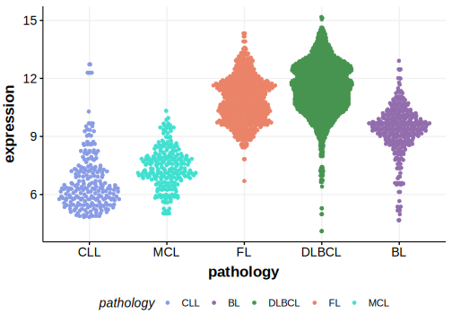

[[_TOC_]]

## Relevance tier by entity

|Entity|Tier|Description                           |
|:------:|:----:|--------------------------------------|
||1|high-confidence PMBL/cHL/GZL gene[@dunsCharacterizationDLBCLPMBL2021]|
| |1 | aSHM target and high-confidence DLBCL gene            [@morinFrequentMutationHistonemodifying2011]|
|    |1 | aSHM target and high-confidence FL gene               [@morinFrequentMutationHistonemodifying2011; @zhangGeneticHeterogeneityDiffuse2013; @morinMutationalStructuralAnalysis2013]|

## Mutation incidence in large patient cohorts (GAMBL reanalysis)

[[include:DLBCL_SGK1.md]]
[[include:FL_SGK1.md]]

## Mutation pattern and selective pressure estimates

[[include:dnds_SGK1.md]]

## aSHM regions

|chr_name|hg19_start|hg19_end |region                                                                                       |regulatory_comment|
|:--------:|:----------:|:---------:|:---------------------------------------------------------------------------------------------:|:------------------:|
|chr6    |134487960 |134499859|[TSS-1](https://genome.ucsc.edu/s/rdmorin/GAMBL%20hg19?position=chr6%3A134487960%2D134499859)|active_promoter   |

## Expression

<!-- ORIGIN: morinFrequentMutationHistonemodifying2011 -->
<!-- FL: morinFrequentMutationHistonemodifying2011 -->
<!-- PMBL: dunsCharacterizationDLBCLPMBL2021b -->
<!-- DLBCL: morinFrequentMutationHistonemodifying2011 -->

[[include:browser_SGK1.md]]

## References