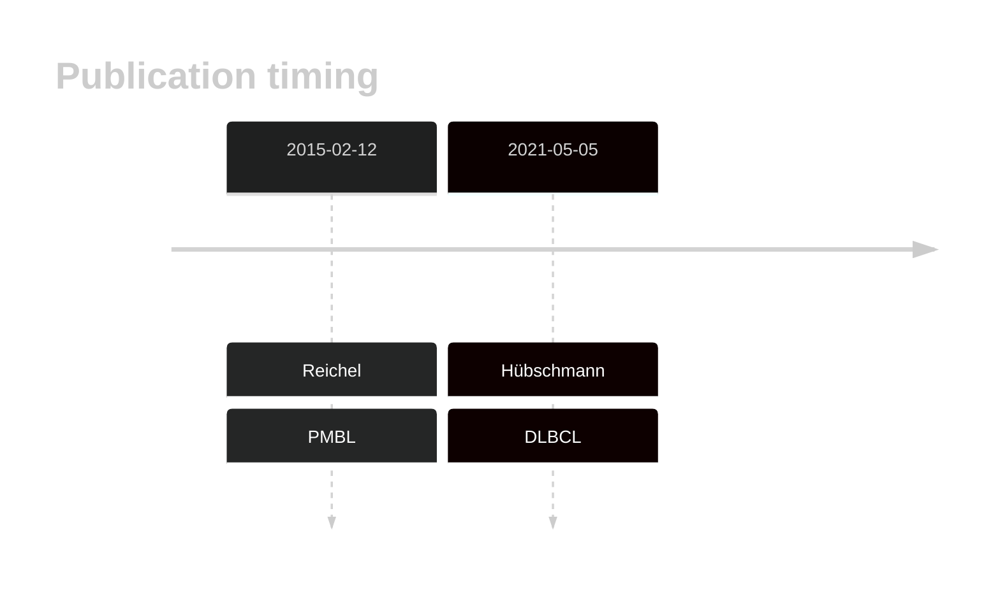

# SIAH2

## History

## Relevance tier by entity

|Entity|Tier|Description                              |
|:------:|:----:|-----------------------------------------|
||2|relevance in PMBL/cHL/GZL not firmly established[@reichelFlowSortingExome2015]|
| |2   |relevance in DLBCL not firmly established[@hubschmannMutationalMechanismsShaping2021]|

## Mutation incidence in large patient cohorts (GAMBL reanalysis)

|Entity|source        |frequency (%)|
|:------:|:--------------:|:-------------:|
|DLBCL |GAMBL genomes |1.72         |
|DLBCL |Schmitz cohort|2.34         |
|DLBCL |Reddy cohort  |1.30         |
|DLBCL |Chapuy cohort |1.28         |

## Mutation pattern and selective pressure estimates

|Entity|aSHM|Significant selection|dN/dS (missense)|dN/dS (nonsense)|
|:------:|:----:|:---------------------:|:----------------:|:----------------:|
|BL    |No  |No                   |0.000           |0               |
|DLBCL |No  |No                   |9.796           |0               |
|FL    |No  |No                   |4.227           |0               |

View coding variants in ProteinPaint [hg19](https://morinlab.github.io/LLMPP/GAMBL/SIAH2_protein.html)  or [hg38](https://morinlab.github.io/LLMPP/GAMBL/SIAH2_protein_hg38.html)

View all variants in GenomePaint [hg19](https://morinlab.github.io/LLMPP/GAMBL/SIAH2.html)  or [hg38](https://morinlab.github.io/LLMPP/GAMBL/SIAH2_hg38.html)

## SIAH2 Expression

<!-- ORIGIN: reichelFlowSortingExome2015a -->
<!-- DLBCL: hubschmannMutationalMechanismsShaping2021b -->
<!-- PMBL: reichelFlowSortingExome2015a -->

## All Mutations

[SP116697](https://www.bcgsc.ca/downloads/morinlab/GAMBL/MALY/SP116697.html)
[SP124969](https://www.bcgsc.ca/downloads/morinlab/GAMBL/MALY/SP124969.html)
[SP59304](https://www.bcgsc.ca/downloads/morinlab/GAMBL/MALY/SP59304.html)
[SP59416](https://www.bcgsc.ca/downloads/morinlab/GAMBL/MALY/SP59416.html)

## References
