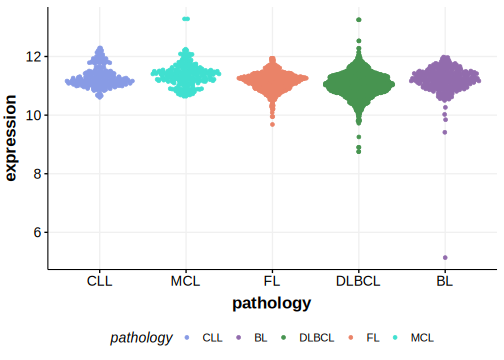

[[_TOC_]]

## Relevance tier by entity

|Entity|Tier|Description               |
|:------:|:----:|--------------------------|
||1|high-confidence PMBL/cHL/GZL gene|
|    |1   |high-confidence BL gene   [@grandeGenomewideDiscoverySomatic2019]|
|    |1   |high-confidence MZL gene   [@rossiCodingGenomeSplenic2012]|
| |1   |high-confidence DLBCL gene[@chapuyMolecularSubtypesDiffuse2018; @arthurGenomewideDiscoverySomatic2018]|

## Mutation incidence in large patient cohorts (GAMBL reanalysis)

[[include:DLBCL_SIN3A.md]]
[[include:BL_SIN3A.md]]

## Mutation pattern and selective pressure estimates

[[include:dnds_SIN3A.md]]

[[include:browser_SIN3A.md]]

## Expression

[[include:mermaid_SIN3A.md]]

## References

<!-- ORIGIN: rossiCodingGenomeSplenic2012c -->
<!-- BL: grandeGenomewideDiscoverySomatic2019 -->
<!-- MZL: rossiCodingGenomeSplenic2012c -->
