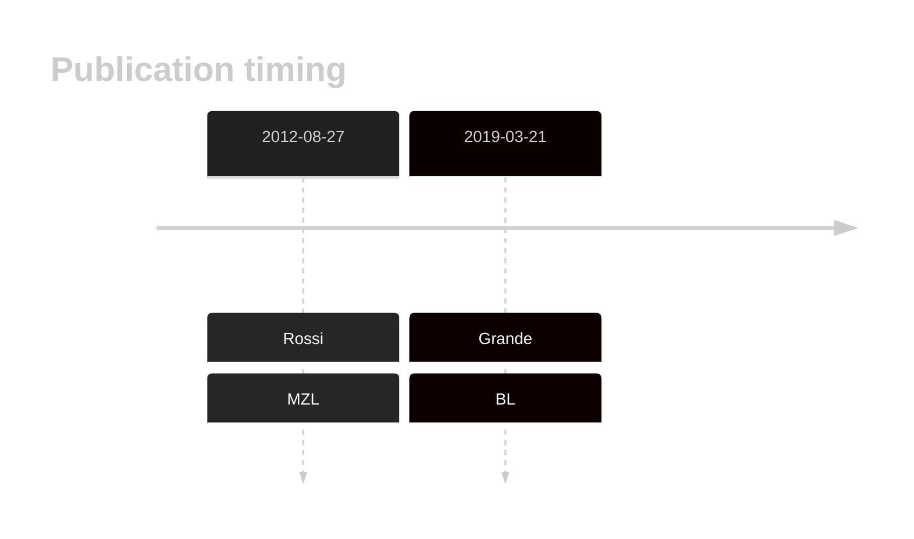

# SIN3A

## History
Mutations in this gene were first described in MZL in 2012 by Rossi et al1 and in BL in 2019 by Grande et al.2

## Relevance tier by entity

|Entity|Tier|Description               |
|:------:|:----:|--------------------------|
||1|high-confidence PMBL/cHL/GZL gene|
|    |1   |high-confidence BL gene   |
|    |1   |high-confidence MZL gene   |
| |1   |high-confidence DLBCL gene|

## Mutation incidence in large patient cohorts (GAMBL reanalysis)

|Entity|source               |frequency (%)|
|:------:|:---------------------:|:-------------:|
|BL    |GAMBL genomes+capture|11.09        |
|BL    |Thomas cohort        |10.60        |
|BL    |Panea cohort         |14.90        |
|DLBCL |GAMBL genomes        | 3.06        |
|DLBCL |Schmitz cohort       | 2.77        |
|DLBCL |Reddy cohort         | 3.00        |
|DLBCL |Chapuy cohort        | 3.85        |

## Mutation pattern and selective pressure estimates

|Entity|aSHM|Significant selection|dN/dS (missense)|dN/dS (nonsense)|
|:------:|:----:|:---------------------:|:----------------:|:----------------:|
|BL    |No  |Yes                  |3.871           |55.210          |
|DLBCL |No  |No                   |2.483           |15.818          |
|FL    |No  |No                   |0.000           |20.676          |

View coding variants in ProteinPaint [hg19](https://morinlab.github.io/LLMPP/GAMBL/SIN3A_protein.html)  or [hg38](https://morinlab.github.io/LLMPP/GAMBL/SIN3A_protein_hg38.html)

View all variants in GenomePaint [hg19](https://morinlab.github.io/LLMPP/GAMBL/SIN3A.html)  or [hg38](https://morinlab.github.io/LLMPP/GAMBL/SIN3A_hg38.html)

## SIN3A Expression

## References

1.  *Rossi D, Trifonov V, Fangazio M, Bruscaggin A, Rasi S, Spina V, Monti S, Vaisitti T, Arruga F, Famà R, Ciardullo C, Greco M, Cresta S, Piranda D, Holmes A, Fabbri G, Messina M, Rinaldi A, Wang J, Agostinelli C, Piccaluga PP, Lucioni M, Tabbò F, Serra R, Franceschetti S, Deambrogi C, Daniele G, Gattei V, Marasca R, Facchetti F, Arcaini L, Inghirami G, Bertoni F, Pileri SA, Deaglio S, Foà R, Dalla-Favera R, Pasqualucci L, Rabadan R, Gaidano G. The coding genome of splenic marginal zone lymphoma: activation of NOTCH2 and other pathways regulating marginal zone development. J Exp Med. 2012 Aug 27;209(9):1537–1551. PMCID: PMC3428941*

2.  *Grande BM, Gerhard DS, Jiang A, Griner NB, Abramson JS, Alexander TB, Allen H, Ayers LW, Bethony JM, Bhatia K, Bowen J, Casper C, Choi JK, Culibrk L, Davidsen TM, Dyer MA, Gastier-Foster JM, Gesuwan P, Greiner TC, Gross TG, Hanf B, Harris NL, He Y, Irvin JD, Jaffe ES, Jones SJM, Kerchan P, Knoetze N, Leal FE, Lichtenberg TM, Ma Y, Martin JP, Martin MR, Mbulaiteye SM, Mullighan CG, Mungall AJ, Namirembe C, Novik K, Noy A, Ogwang MD, Omoding A, Orem J, Reynolds SJ, Rushton CK, Sandlund JT, Schmitz R, Taylor C, Wilson WH, Wright GW, Zhao EY, Marra MA, Morin RD, Staudt LM. Genome-wide discovery of somatic coding and noncoding mutations in pediatric endemic and sporadic Burkitt lymphoma. Blood. 2019 Mar 21;133(12):1313–1324.* 

<!-- ORIGIN: rossiCodingGenomeSplenic2012c -->
<!-- BL: grandeGenomewideDiscoverySomatic2019 -->
<!-- MZL: rossiCodingGenomeSplenic2012c -->
