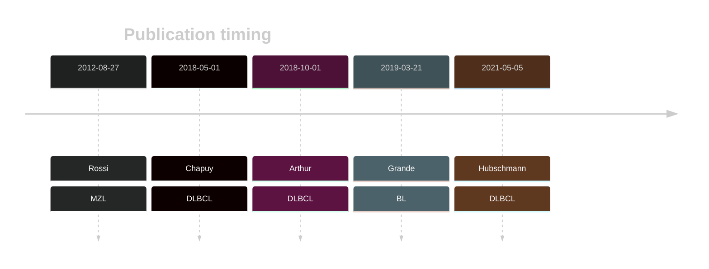
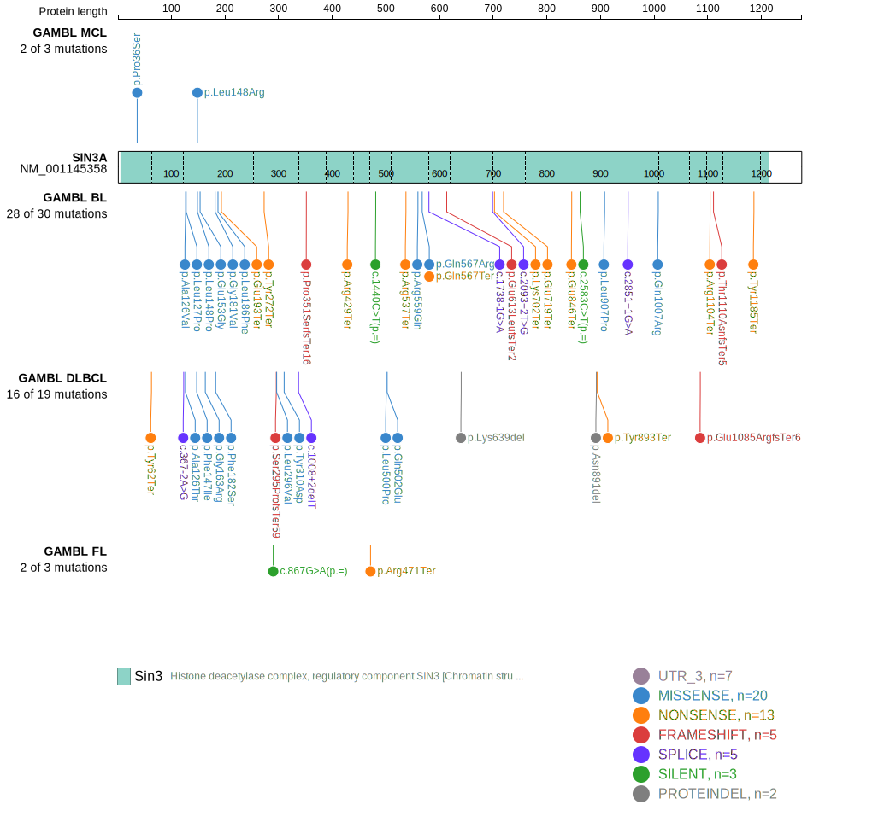
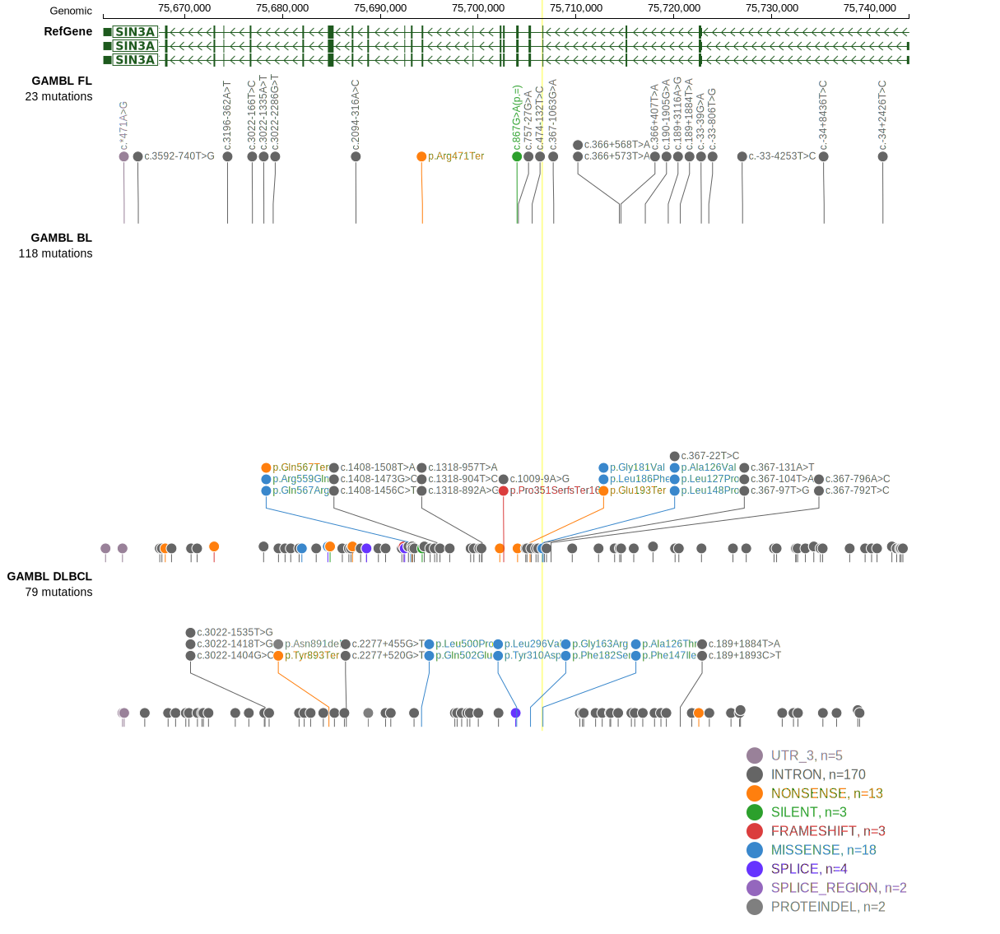

# SIN3A

## History

## Relevance tier by entity

|Entity|Tier|Description               |
|:------:|:----:|--------------------------|
||1|high-confidence PMBL/cHL/GZL gene|
|    |1   |high-confidence BL gene   [@grandeGenomewideDiscoverySomatic2019]|
|    |1   |high-confidence MZL gene   [@rossiCodingGenomeSplenic2012]|
| |1   |high-confidence DLBCL gene[@chapuyMolecularSubtypesDiffuse2018b; @arthurGenomewideDiscoverySomatic2018]|

## Mutation incidence in large patient cohorts (GAMBL reanalysis)

|Entity|source               |frequency (%)|
|:------:|:---------------------:|:-------------:|
|BL    |GAMBL genomes+capture|11.09        |
|BL    |Thomas cohort        |10.60        |
|BL    |Panea cohort         |14.90        |
|DLBCL |GAMBL genomes        | 3.06        |
|DLBCL |Schmitz cohort       | 2.77        |
|DLBCL |Reddy cohort         | 3.00        |
|DLBCL |Chapuy cohort        | 3.85        |

## Mutation pattern and selective pressure estimates

|Entity|aSHM|Significant selection|dN/dS (missense)|dN/dS (nonsense)|
|:------:|:----:|:---------------------:|:----------------:|:----------------:|
|BL    |No  |Yes                  |3.871           |55.210          |
|DLBCL |No  |No                   |2.483           |15.818          |
|FL    |No  |No                   |0.000           |20.676          |

View coding variants in ProteinPaint [hg19](https://morinlab.github.io/LLMPP/GAMBL/SIN3A_protein.html)  or [hg38](https://morinlab.github.io/LLMPP/GAMBL/SIN3A_protein_hg38.html)

View all variants in GenomePaint [hg19](https://morinlab.github.io/LLMPP/GAMBL/SIN3A.html)  or [hg38](https://morinlab.github.io/LLMPP/GAMBL/SIN3A_hg38.html)

## SIN3A Expression

## References

<!-- ORIGIN: rossiCodingGenomeSplenic2012c -->
<!-- BL: grandeGenomewideDiscoverySomatic2019 -->
<!-- MZL: rossiCodingGenomeSplenic2012c -->
