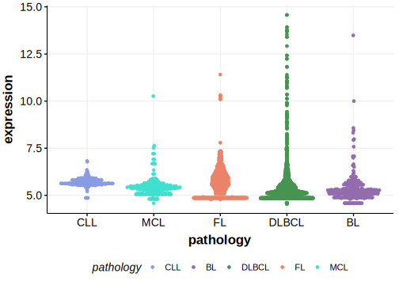

[[_TOC_]]

## Relevance tier by entity

[[include:table1_SLC34A2.md]]

## Mutation incidence in large patient cohorts (GAMBL reanalysis)

|Entity|source        |frequency (%)|
|:------:|:--------------:|:-------------:|
|DLBCL |GAMBL genomes |0.76         |
|DLBCL |Schmitz cohort|1.70         |
|DLBCL |Reddy cohort  |1.40         |
|DLBCL |Chapuy cohort |0.85         |

## Mutation pattern and selective pressure estimates

[[include:dnds_SLC34A2.md]]

[[include:browser_SLC34A2.md]]

## Expression

<!-- ORIGIN: hubschmannMutationalMechanismsShaping2021b -->
<!-- DLBCL: hubschmannMutationalMechanismsShaping2021b -->

## All Mutations

[SP116668](https://www.bcgsc.ca/downloads/morinlab/GAMBL/MALY/SP116668.html)
[SP192997](https://www.bcgsc.ca/downloads/morinlab/GAMBL/MALY/SP192997.html)
[SP193312](https://www.bcgsc.ca/downloads/morinlab/GAMBL/MALY/SP193312.html)
[SP194108](https://www.bcgsc.ca/downloads/morinlab/GAMBL/MALY/SP194108.html)

[[include:mermaid_SLC34A2.md]]

## References

