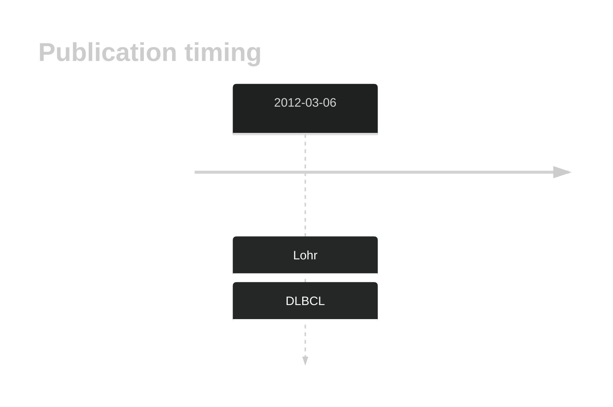

# SLITRK6

## History

## Relevance tier by entity

|Entity|Tier|Description|
|:------:|:----:|--------------------------------------|
||2|relevance in DLBCL not firmly established[@lohrDiscoveryPrioritizationSomatic2012a]|

## Mutation incidence in large patient cohorts (GAMBL reanalysis)

|Entity|source |frequency (%)|
|:------:|:----:|:----:|
|BL|GAMBL Exome |5.172 |
|BL|GAMBL Genome |2.317 |
|DLBCL|GAMBL Exome |3.073 |
|DLBCL|GAMBL Genome |3.571 |
|FL|GAMBL Exome |2.865 |

## References

