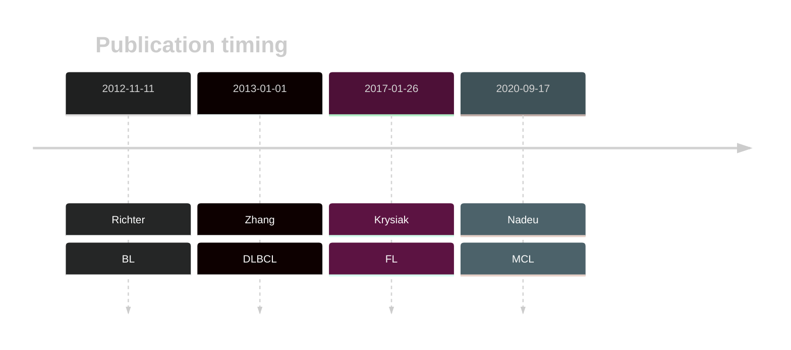

# SMARCA4
## History

## Relevance tier by entity

|Entity|Tier|Description               |
|:------:|:----:|--------------------------|
||1|high-confidence PMBL/cHL/GZL gene|
|    |1   |high-confidence BL gene   |
| |1   |high-confidence DLBCL gene|
|    |1   |high-confidence FL gene   |
|   |1   |high-confidence MCL gene  |

## Mutation incidence in large patient cohorts (GAMBL reanalysis)

|Entity|source               |frequency (%)|
|:------:|:---------------------:|:-------------:|
|BL    |GAMBL genomes+capture|22.63        |
|BL    |Thomas cohort        |17.80        |
|BL    |Panea cohort         |18.80        |
|DLBCL |GAMBL genomes        | 3.25        |
|DLBCL |Schmitz cohort       | 2.98        |
|DLBCL |Reddy cohort         | 3.30        |
|DLBCL |Chapuy cohort        | 2.14        |
|FL    |GAMBL genomes        | 4.16        |
|MCL   |GAMBL genomes        | 4.74        |

## Mutation pattern and selective pressure estimates

|Entity|aSHM|Significant selection|dN/dS (missense)|dN/dS (nonsense)|
|:------:|:----:|:---------------------:|:----------------:|:----------------:|
|BL    |No  |Yes                  |13.014          |7.632           |
|DLBCL |No  |No                   | 3.876          |0.000           |
|FL    |No  |No                   |11.081          |0.000           |

> [!NOTE]
> First described in BL in 2012 by [Love C](https://pubmed.ncbi.nlm.nih.gov/23143597). First described in DLBCL in 2013 by [Zhang J](https://pubmed.ncbi.nlm.nih.gov/23292937). First described in FL in 2023 by [Russler-Germain DA](https://pubmed.ncbi.nlm.nih.gov/37493986). First described in MCL in 2020 by [Nadeu F](https://pubmed.ncbi.nlm.nih.gov/32584970)

View coding variants in ProteinPaint [hg19](https://morinlab.github.io/LLMPP/GAMBL/SMARCA4_protein.html)  or [hg38](https://morinlab.github.io/LLMPP/GAMBL/SMARCA4_protein_hg38.html)

View all variants in GenomePaint [hg19](https://morinlab.github.io/LLMPP/GAMBL/SMARCA4.html)  or [hg38](https://morinlab.github.io/LLMPP/GAMBL/SMARCA4_hg38.html)

## SMARCA4 Expression

<!-- ORIGIN: zhangGeneticHeterogeneityDiffuse2013 -->
<!-- MCL: nadeuGenomicEpigenomicInsights2020a -->
<!-- DLBCL: zhangGeneticHeterogeneityDiffuse2013 -->
<!-- FL: krysiakRecurrentSomaticMutations2017b -->
<!-- BL: richterRecurrentMutationID32012a -->
## References
1.  Richter J, Schlesner M, Hoffmann S, Kreuz M, Leich E, Burkhardt B, Rosolowski M, Ammerpohl O, Wagener R, Bernhart SH, Lenze D, Szczepanowski M, Paulsen M, Lipinski S, Russell RB, Adam-Klages S, Apic G, Claviez A, Hasenclever D, Hovestadt V, Hornig N, Korbel JO, Kube D, Langenberger D, Lawerenz C, Lisfeld J, Meyer K, Picelli S, Pischimarov J, Radlwimmer B, Rausch T, Rohde M, Schilhabel M, Scholtysik R, Spang R, Trautmann H, Zenz T, Borkhardt A, Drexler HG, Möller P, MacLeod RAF, Pott C, Schreiber S, Trümper L, Loeffler M, Stadler PF, Lichter P, Eils R, Küppers R, Hummel M, Klapper W, Rosenstiel P, Rosenwald A, Brors B, Siebert R, ICGC MMML-Seq Project. Recurrent mutation of the ID3 gene in Burkitt lymphoma identified by integrated genome, exome and transcriptome sequencing. Nat Genet. 2012 Dec;44(12):1316–1320. PMID: 23143595
2.  Zhang J, Grubor V, Love CL, Banerjee A, Richards KL, Mieczkowski PA, Dunphy C, Choi W, Au WY, Srivastava G, Lugar PL, Rizzieri DA, Lagoo AS, Bernal-Mizrachi L, Mann KP, Flowers C, Naresh K, Evens A, Gordon LI, Czader M, Gill JI, Hsi ED, Liu Q, Fan A, Walsh K, Jima D, Smith LL, Johnson AJ, Byrd JC, Luftig MA, Ni T, Zhu J, Chadburn A, Levy S, Dunson D, Dave SS. Genetic heterogeneity of diffuse large B-cell lymphoma. 2013 Jan; 
3.  Krysiak K, Gomez F, White BS, Matlock M, Miller CA, Trani L, Fronick CC, Fulton RS, Kreisel F, Cashen AF, Carson KR, Berrien-Elliott MM, Bartlett NL, Griffith M, Griffith OL, Fehniger TA. Recurrent somatic mutations affecting B-cell receptor signaling pathway genes in follicular lymphoma. Blood. 2017 Jan 26;129(4):473–483. PMCID: PMC5270390
4.  Nadeu F, Martín-García D, Clot G, Díaz-Navarro A, Duran-Ferrer M, Navarro A, Vilarrasa-Blasi R, Kulis M, Royo R, Gutiérrez-Abril J, Valdés-Mas R, López C, Chapaprieta V, Puiggrós M, Castellano G, Costa D, Aymerich M, Jares P, Espinet B, Muntañola A, Ribera‐Cortada I, Siebert R, Colomer D, Torrents D, Giné E, López-Guillermo A, Küppers R, Martín-Subero J, Puente X, Beà S, Campo E. Genomic and epigenomic insights into the origin, pathogenesis and clinical behavior of mantle cell lymphoma subtypes. Blood. 2020; 
