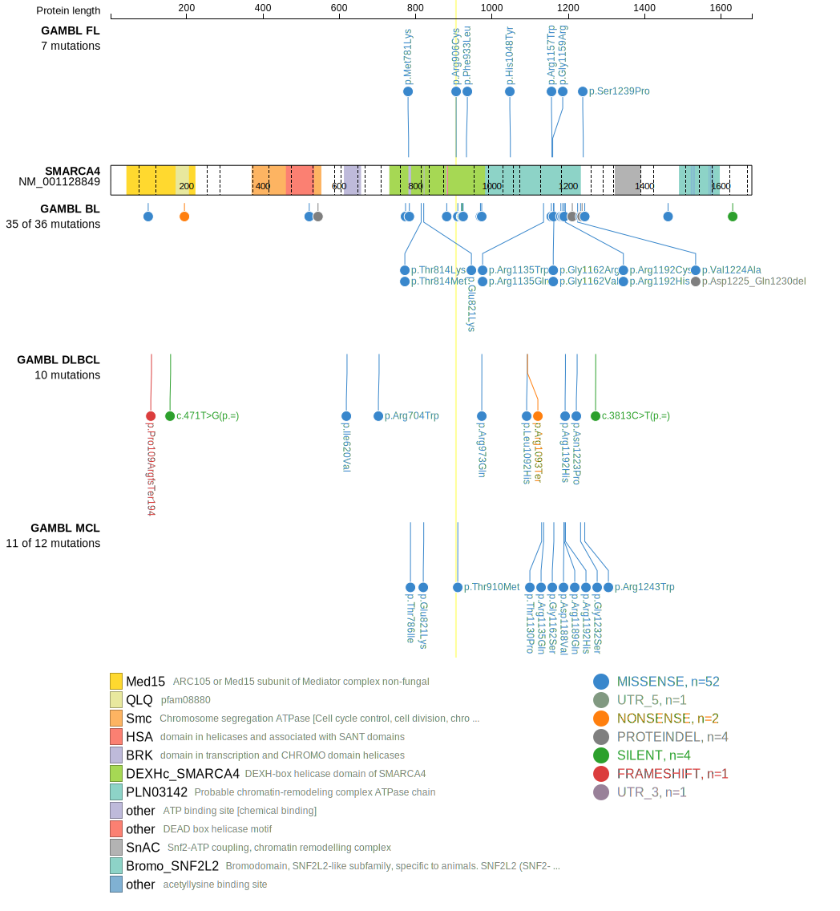
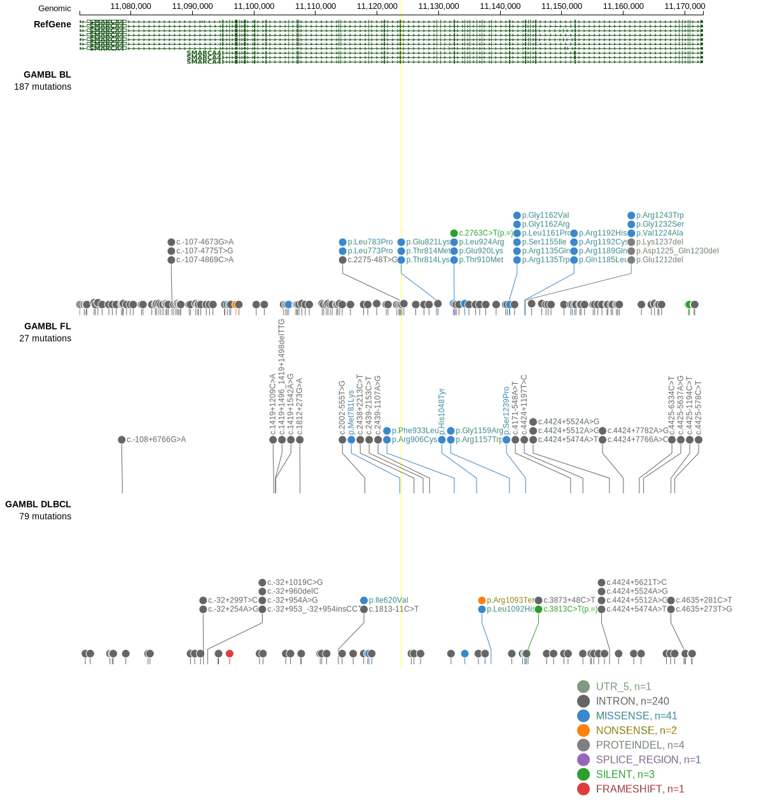

# [SMARCA4]

## Mutation tier

|Entity|Tier|Description               |
|:------:|:----:|--------------------------|
|BL    |1   |high-confidence BL gene   |
|DLBCL |1   |high-confidence DLBCL gene|
|FL    |1   |high-confidence FL gene   |
## Mutation incidence

|Entity|source               |frequency (%)|
|:------:|:---------------------:|:-------------:|
|BL    |GAMBL genomes+capture|22.63        |
|BL    |Thomas cohort        |17.80        |
|BL    |Panea cohort         |18.80        |
|DLBCL |GAMBL genomes        | 3.25        |
|DLBCL |Schmitz cohort       | 3.00        |
|DLBCL |Reddy cohort         | 3.30        |
|DLBCL |Chapuy cohort        | 2.10        |
|FL    |GAMBL genomes        | 4.16        |

## Mutation pattern

|Entity|aSHM|Significant selection|dN/dS (missense)|dN/dS (nonsense)|
|:------:|:----:|:---------------------:|:----------------:|:----------------:|
|BL    |No  |Yes                  |13.014          |7.632           |
|DLBCL |No  |No                   | 3.876          |0.000           |
|FL    |No  |No                   |11.081          |0.000           |

> [!NOTE]
> First described in BL in 2012 by [Love C](https://pubmed.ncbi.nlm.nih.gov/23143597). First described in DLBCL in 2013 by [Zhang J](https://pubmed.ncbi.nlm.nih.gov/23292937). First described in FL in 2023 by [Russler-Germain DA](https://pubmed.ncbi.nlm.nih.gov/37493986)

 ## SMARCA4 Hotspots

| Chromosome |Coordinate (hg19) | ref>alt | HGVSp | 
 | :---:| :---: | :--: | :---: |
| chr19 | 11134241 | C>A | H969Q |
| chr19 | 11134251 | C>T | R973W |
| chr19 | 11134252 | G>A | R973Q |
| chr19 | 11141562 | C>T | P1180L |
| chr19 | 11143973 | A>T | Q1185L |
| chr19 | 11143982 | A>T | D1188V |
| chr19 | 11143985 | G>A | R1189Q |
| chr19 | 11143993 | C>T | R1192C |
| chr19 | 11143994 | G>A | R1192H |

View coding variants in ProteinPaint [hg19](https://www.bcgsc.ca/downloads/morinlab/GAMBL/test/genes/SMARCA4_protein.html)  or [hg38](https://www.bcgsc.ca/downloads/morinlab/GAMBL/test/genes/SMARCA4_protein_hg38.html)

View all variants in GenomePaint [hg19](https://www.bcgsc.ca/downloads/morinlab/GAMBL/test/genes/SMARCA4.html)  or [hg38](https://www.bcgsc.ca/downloads/morinlab/GAMBL/test/genes/SMARCA4_hg38.html)

