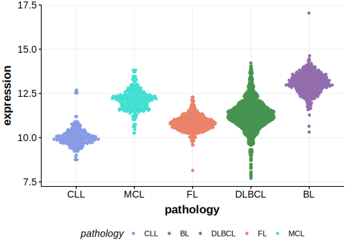

# SMARCA4

## Relevance tier by entity

|Entity|Tier|Description               |
|:------:|:----:|--------------------------|
|    |1   |high-confidence BL gene   |
| |1   |high-confidence DLBCL gene|
|    |1   |high-confidence FL gene   |
|   |1   |high-confidence MCL gene  |

## Mutation incidence in large patient cohorts (GAMBL reanalysis)

|Entity|source               |frequency (%)|
|:------:|:---------------------:|:-------------:|
|BL    |GAMBL genomes+capture|22.63        |
|BL    |Thomas cohort        |17.80        |
|BL    |Panea cohort         |18.80        |
|DLBCL |GAMBL genomes        | 3.25        |
|DLBCL |Schmitz cohort       | 2.98        |
|DLBCL |Reddy cohort         | 3.30        |
|DLBCL |Chapuy cohort        | 2.14        |
|FL    |GAMBL genomes        | 4.16        |
|MCL   |GAMBL genomes        | 4.74        |

## Mutation pattern and selective pressure estimates

|Entity|aSHM|Significant selection|dN/dS (missense)|dN/dS (nonsense)|
|:------:|:----:|:---------------------:|:----------------:|:----------------:|
|BL    |No  |Yes                  |13.014          |7.632           |
|DLBCL |No  |No                   | 3.876          |0.000           |
|FL    |No  |No                   |11.081          |0.000           |

> [!NOTE]
> First described in BL in 2012 by [Love C](https://pubmed.ncbi.nlm.nih.gov/23143597). First described in DLBCL in 2013 by [Zhang J](https://pubmed.ncbi.nlm.nih.gov/23292937). First described in FL in 2023 by [Russler-Germain DA](https://pubmed.ncbi.nlm.nih.gov/37493986). First described in MCL in 2020 by [Nadeu F](https://pubmed.ncbi.nlm.nih.gov/32584970)

View coding variants in ProteinPaint [hg19](https://morinlab.github.io/LLMPP/GAMBL/SMARCA4_protein.html)  or [hg38](https://morinlab.github.io/LLMPP/GAMBL/SMARCA4_protein_hg38.html)

View all variants in GenomePaint [hg19](https://morinlab.github.io/LLMPP/GAMBL/SMARCA4.html)  or [hg38](https://morinlab.github.io/LLMPP/GAMBL/SMARCA4_hg38.html)

## SMARCA4 Expression

<!-- ORIGIN: zhangGeneticHeterogeneityDiffuse2013 -->
<!-- MCL: nadeuGenomicEpigenomicInsights2020a -->
<!-- DLBCL: zhangGeneticHeterogeneityDiffuse2013 -->
<!-- FL: krysiakRecurrentSomaticMutations2017b -->
<!-- BL: richterRecurrentMutationID32012a -->
