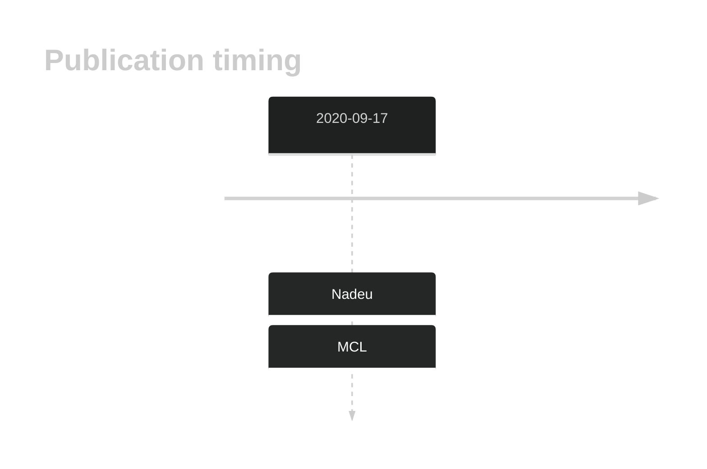
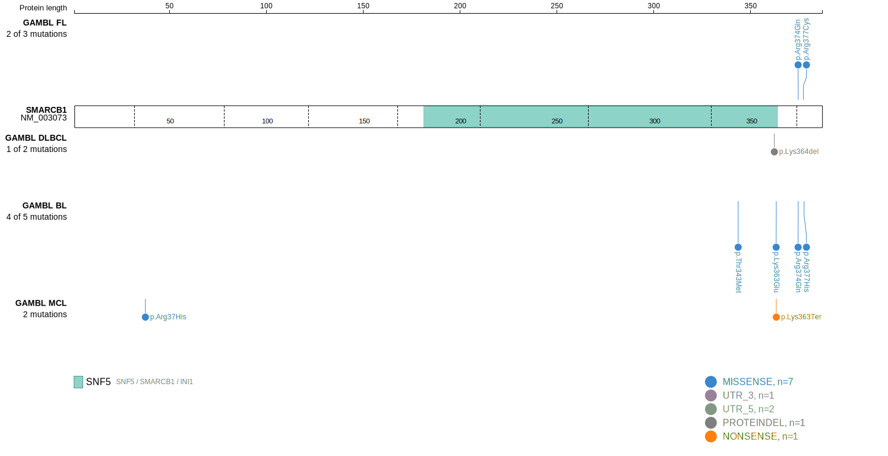
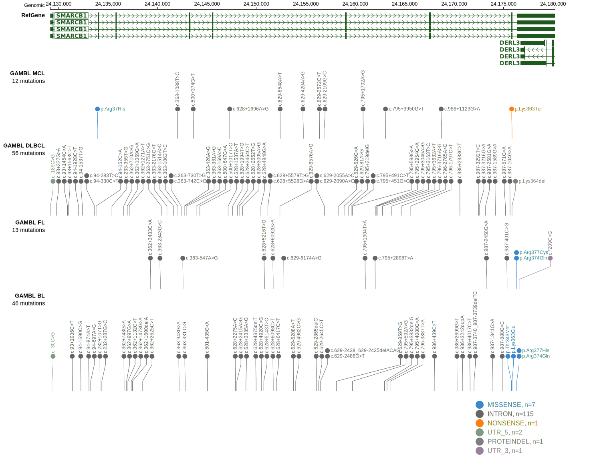

# SMARCB1

## History

## Relevance tier by entity

|Entity|Tier|Description                            |
|:------:|:----:|---------------------------------------|
|   |2   |relevance in MCL not firmly established[@nadeuGenomicEpigenomicInsights2020b]|

## Mutation incidence in large patient cohorts (GAMBL reanalysis)

|Entity|source       |frequency (%)|
|:------:|:-------------:|:-------------:|
|MCL   |GAMBL genomes|1.9          |

## Mutation pattern and selective pressure estimates

|Entity|aSHM|Significant selection|dN/dS (missense)|dN/dS (nonsense)|
|:------:|:----:|:---------------------:|:----------------:|:----------------:|
|BL    |No  |No                   |10.709          |0               |
|DLBCL |No  |No                   | 0.000          |0               |
|FL    |No  |No                   |15.559          |0               |

View coding variants in ProteinPaint [hg19](https://morinlab.github.io/LLMPP/GAMBL/SMARCB1_protein.html)  or [hg38](https://morinlab.github.io/LLMPP/GAMBL/SMARCB1_protein_hg38.html)

View all variants in GenomePaint [hg19](https://morinlab.github.io/LLMPP/GAMBL/SMARCB1.html)  or [hg38](https://morinlab.github.io/LLMPP/GAMBL/SMARCB1_hg38.html)

## SMARCB1 Expression

<!-- ORIGIN: nadeuGenomicEpigenomicInsights2020a -->
<!-- MCL: nadeuGenomicEpigenomicInsights2020b -->

## References

