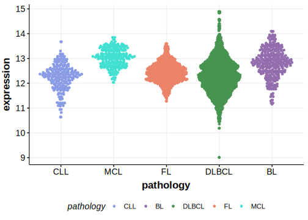

[[_TOC_]]

## Relevance tier by entity

[[include:tables/table1_SMARCB1.md]]

## Mutation incidence in large patient cohorts (GAMBL reanalysis)

|Entity|source       |frequency (%)|
|:------:|:-------------:|:-------------:|
|MCL   |GAMBL genomes|1.9          |

## Mutation pattern and selective pressure estimates

|Entity|aSHM|Significant selection|dN/dS (missense)|dN/dS (nonsense)|
|:------:|:----:|:---------------------:|:----------------:|:----------------:|
|BL    |No  |No                   |10.709          |0               |
|DLBCL |No  |No                   | 0.000          |0               |
|FL    |No  |No                   |15.559          |0               |

[[include:browser_SMARCB1.md]]

## Expression

<!-- ORIGIN: nadeuGenomicEpigenomicInsights2020a -->
<!-- MCL: nadeuGenomicEpigenomicInsights2020b -->

[[include:tables/mermaid_SMARCB1.md]]

## References

