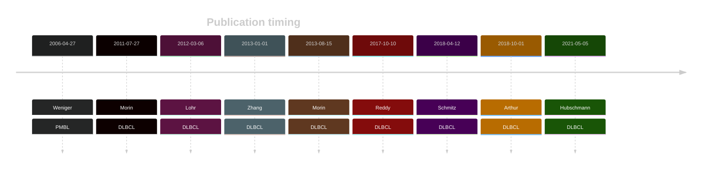

# SOCS1

## History

## Relevance tier by entity

|Entity|Tier|Description                           |
|:------:|:----:|--------------------------------------|
||1|high-confidence MZL gene|
||1|high-confidence PMBL/cHL/GZL gene[@wenigerMutationsTumorSuppressor2006]|
| |1 | aSHM target and high-confidence DLBCL gene            [@morinFrequentMutationHistonemodifying2011; @lohrDiscoveryPrioritizationSomatic2012; @zhangGeneticHeterogeneityDiffuse2013; @morinMutationalStructuralAnalysis2013]|
|    |1 | aSHM target and high-confidence FL gene               |

## Mutation incidence in large patient cohorts (GAMBL reanalysis)

[[include:DLBCL_SOCS1.md]]
[[include:FL_SOCS1.md]]

## Mutation pattern and selective pressure estimates

[[include:dnds_SOCS1.md]]

## aSHM regions

|chr_name|hg19_start|hg19_end|region                                                                                         |regulatory_comment|
|:--------:|:----------:|:--------:|:-----------------------------------------------------------------------------------------------:|:------------------:|
|chr16   |11347512  |11350007|[intron-1](https://genome.ucsc.edu/s/rdmorin/GAMBL%20hg19?position=chr16%3A11347512%2D11350007)|enhancer          |

View coding variants in ProteinPaint [hg19](https://morinlab.github.io/LLMPP/GAMBL/SOCS1_protein.html)  or [hg38](https://morinlab.github.io/LLMPP/GAMBL/SOCS1_protein_hg38.html)

View all variants in GenomePaint [hg19](https://morinlab.github.io/LLMPP/GAMBL/SOCS1.html)  or [hg38](https://morinlab.github.io/LLMPP/GAMBL/SOCS1_hg38.html)

## SOCS1 Expression

<!-- ORIGIN: wenigerMutationsTumorSuppressor2006a -->
<!-- PMBL: wenigerMutationsTumorSuppressor2006a -->
<!-- DLBCL: morinFrequentMutationHistonemodifying2011 -->

## References
